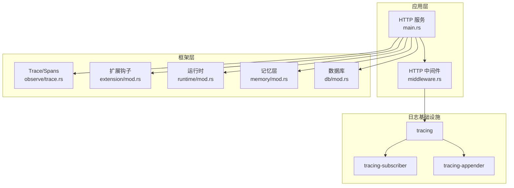
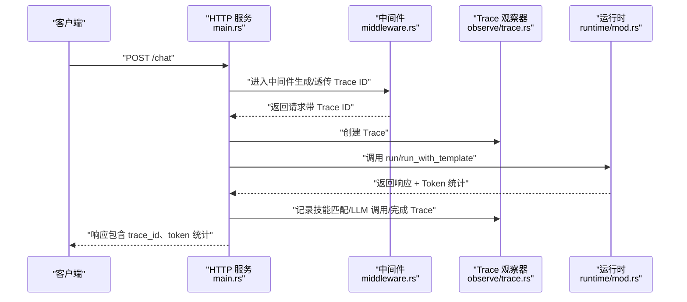
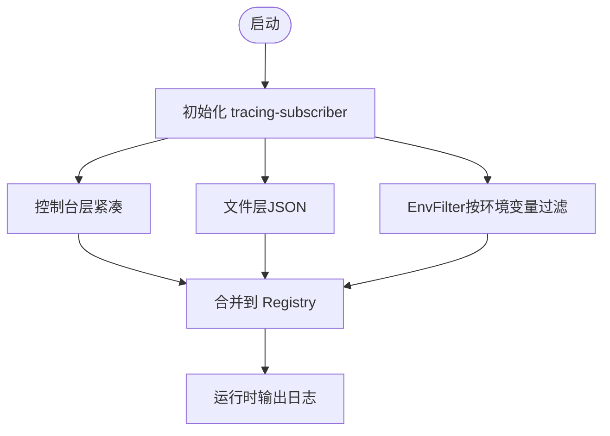
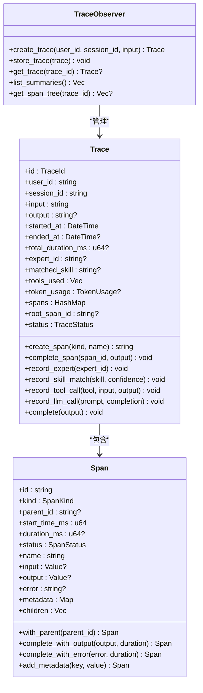
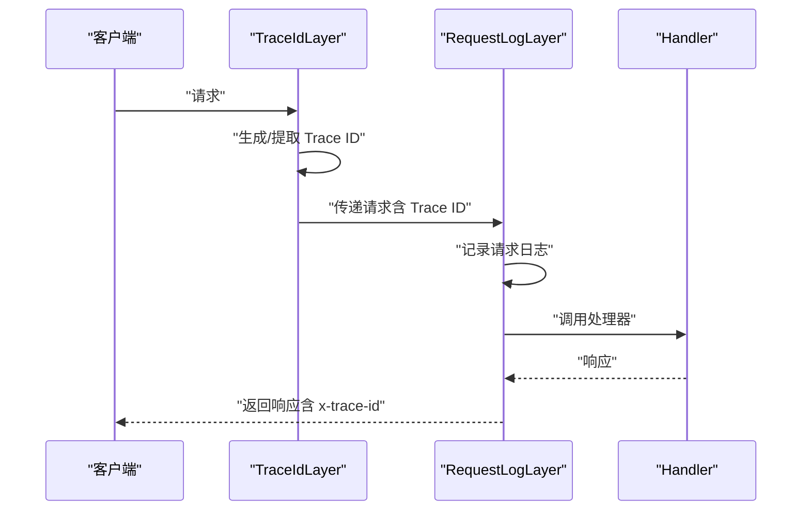
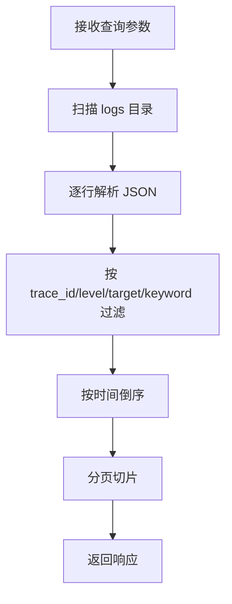
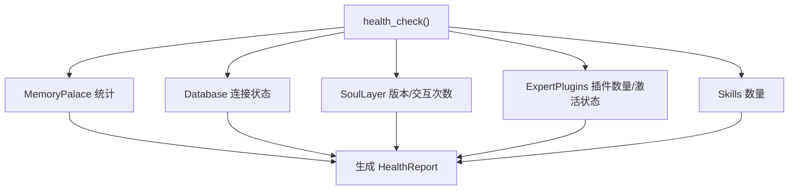
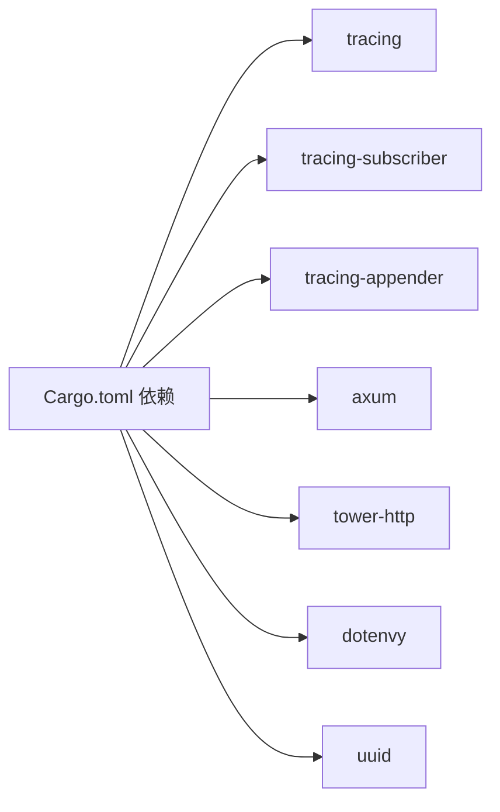

# 监控与日志

<cite>
**本文引用的文件**   
- [lib.rs](file://crates/subhuti/src/lib.rs)
- [trace.rs](file://crates/subhuti/src/observe/trace.rs)
- [middleware.rs](file://src/bin/http_server/middleware.rs)
- [main.rs](file://src/bin/http_server/main.rs)
- [mod.rs](file://crates/subhuti/src/db/mod.rs)
- [mod.rs](file://crates/subhuti/src/extension/mod.rs)
- [mod.rs](file://crates/subhuti/src/runtime/mod.rs)
- [mod.rs](file://crates/subhuti/src/memory/mod.rs)
- [Cargo.toml](file://Cargo.toml)
</cite>

## 目录
1. [简介](#简介)
2. [项目结构](#项目结构)
3. [核心组件](#核心组件)
4. [架构总览](#架构总览)
5. [详细组件分析](#详细组件分析)
6. [依赖关系分析](#依赖关系分析)
7. [性能考量](#性能考量)
8. [故障排查指南](#故障排查指南)
9. [结论](#结论)
10. [附录](#附录)

## 简介
本文件面向 Subhuti 框架的监控与日志体系，围绕以下目标展开：
- 日志配置：结构化日志格式、日志级别、日志轮转策略
- 指标采集：可观测性追踪（Trace/Spans）、Token 统计、健康检查
- 告警与运维：基于日志与健康检查的告警建议
- 监控仪表板：关键指标可视化、性能趋势、异常检测
- 分布式追踪：链路追踪、性能分析、调用链可视化
- 日志聚合与 ELK 集成：日志采集、过滤、存储与查询
- Prometheus 指标暴露：当前仓库未实现，提供接入建议

## 项目结构
Subhuti 采用多模块分层设计，监控与日志相关的关键模块如下：
- 观测性（Trace/Spans）：crates/subhuti/src/observe/trace.rs
- HTTP 中间件（日志与追踪 ID）：src/bin/http_server/middleware.rs
- HTTP 服务（路由与日志查询）：src/bin/http_server/main.rs
- 日志基础设施（tracing + tracing-subscriber + tracing-appender）：Cargo.toml
- 数据库与日志集成：crates/subhuti/src/db/mod.rs
- 扩展钩子（日志与 Token 统计）：crates/subhuti/src/extension/mod.rs
- 运行时与 Token 统计：crates/subhuti/src/runtime/mod.rs
- 记忆层与 TTL：crates/subhuti/src/memory/mod.rs

图表来源
- [main.rs:1324-1455](file://src/bin/http_server/main.rs#L1324-L1455)
- [middleware.rs:174-223](file://src/bin/http_server/middleware.rs#L174-L223)
- [trace.rs:1-120](file://crates/subhuti/src/observe/trace.rs#L1-L120)
- [mod.rs:1-120](file://crates/subhuti/src/runtime/mod.rs#L1-L120)
- [mod.rs:1-120](file://crates/subhuti/src/memory/mod.rs#L1-L120)
- [mod.rs:1-120](file://crates/subhuti/src/db/mod.rs#L1-L120)
- [mod.rs:250-320](file://crates/subhuti/src/extension/mod.rs#L250-L320)
- [Cargo.toml:25-58](file://Cargo.toml#L25-L58)

章节来源
- [main.rs:1324-1455](file://src/bin/http_server/main.rs#L1324-L1455)
- [middleware.rs:174-223](file://src/bin/http_server/middleware.rs#L174-L223)
- [Cargo.toml:25-58](file://Cargo.toml#L25-L58)

## 核心组件
- 结构化日志与轮转
  - 控制台与文件双通道输出，文件采用 JSON 格式，支持按日期轮转
  - 日志级别通过环境变量动态控制
- Trace/Spans 追踪
  - TraceId、Span、SpanKind、SpanStatus、TokenUsage 等结构
  - 支持创建/完成 Span、记录专家切换、工具调用、LLM 调用等
- HTTP 中间件
  - Trace ID 生成与透传
  - 请求日志记录（方法、路径、状态码、耗时、Trace ID）
- 日志查询 API
  - 支持按 Trace ID、级别、目标、关键词过滤，分页返回
- 健康检查
  - 组件健康状态汇总，包含 MemoryPalace、Database、SoulLayer、ExpertPlugins、Skills 等
- Token 统计
  - 运行时返回 Token 使用统计，Trace 中记录 LLM Token 消耗
- 数据库日志
  - 数据库连接、迁移、索引创建等关键步骤均记录日志

章节来源
- [middleware.rs:174-223](file://src/bin/http_server/middleware.rs#L174-L223)
- [trace.rs:182-437](file://crates/subhuti/src/observe/trace.rs#L182-L437)
- [main.rs:1002-1168](file://src/bin/http_server/main.rs#L1002-L1168)
- [mod.rs:50-180](file://crates/subhuti/src/db/mod.rs#L50-L180)
- [mod.rs:160-175](file://crates/subhuti/src/runtime/mod.rs#L160-L175)
- [mod.rs:250-320](file://crates/subhuti/src/extension/mod.rs#L250-L320)

## 架构总览
Subhuti 的监控与日志架构由“基础设施层 + 应用层 + 框架层”组成：
- 基础设施层：tracing + tracing-subscriber + tracing-appender 提供日志采集、格式化与落盘
- 应用层：HTTP 服务通过中间件注入 Trace ID，并在处理器中创建/完成 Trace；同时提供日志查询 API
- 框架层：运行时负责 Token 统计；扩展钩子负责日志与 Token 统计；TraceStore 负责内存/磁盘存储

图表来源
- [main.rs:398-485](file://src/bin/http_server/main.rs#L398-L485)
- [middleware.rs:15-82](file://src/bin/http_server/middleware.rs#L15-L82)
- [trace.rs:233-386](file://crates/subhuti/src/observe/trace.rs#L233-L386)
- [mod.rs:160-175](file://crates/subhuti/src/runtime/mod.rs#L160-L175)

## 详细组件分析

### 日志配置与轮转
- 结构化日志
  - 控制台：紧凑模式，包含目标、线程、时间戳等
  - 文件：JSON 格式，包含字段、文件名、行号、Span 事件等
- 日志级别
  - 通过环境变量动态设置，默认过滤掉部分噪声日志
- 日志轮转
  - 按日期轮转，文件名包含日期
- 日志落盘
  - 使用非阻塞 writer，避免 IO 阻塞

图表来源
- [middleware.rs:174-223](file://src/bin/http_server/middleware.rs#L174-L223)

章节来源
- [middleware.rs:174-223](file://src/bin/http_server/middleware.rs#L174-L223)
- [Cargo.toml:29-31](file://Cargo.toml#L29-L31)

### Trace/Spans 追踪
- Trace 结构
  - 包含 TraceId、用户/会话、输入/输出、状态、Token 使用、所有 Span、根 Span 等
- Span 结构
  - SpanId、父 SpanId、类型、开始时间、持续时间、状态、输入/输出、错误、元数据、子 Span
- 追踪能力
  - 创建/完成 Span、记录专家切换、技能匹配、工具调用、LLM 调用
  - 支持内存存储与文件持久化（可选）

图表来源
- [trace.rs:182-460](file://crates/subhuti/src/observe/trace.rs#L182-L460)
- [trace.rs:609-669](file://crates/subhuti/src/observe/trace.rs#L609-L669)

章节来源
- [trace.rs:182-437](file://crates/subhuti/src/observe/trace.rs#L182-L437)
- [trace.rs:461-601](file://crates/subhuti/src/observe/trace.rs#L461-L601)

### HTTP 中间件与请求日志
- Trace ID 中间件
  - 从请求头读取或生成 UUID，放入请求扩展与响应头
- 请求日志中间件
  - 记录方法、路径、状态码、耗时、Trace ID，使用独立 target
- 初始化日志
  - 同时输出到控制台与文件，支持 JSON 格式落盘

图表来源
- [middleware.rs:15-82](file://src/bin/http_server/middleware.rs#L15-L82)
- [middleware.rs:96-172](file://src/bin/http_server/middleware.rs#L96-L172)

章节来源
- [middleware.rs:15-82](file://src/bin/http_server/middleware.rs#L15-L82)
- [middleware.rs:96-172](file://src/bin/http_server/middleware.rs#L96-L172)
- [middleware.rs:174-223](file://src/bin/http_server/middleware.rs#L174-L223)

### 日志查询 API
- 查询参数
  - trace_id、level、target、keyword、page、page_size
- 查询逻辑
  - 读取 logs 目录下所有 JSON 日志，解析并过滤，按时间倒序分页返回
- 响应结构
  - total、page、page_size、logs（包含 timestamp、level、target、message、fields 等）

图表来源
- [main.rs:1002-1168](file://src/bin/http_server/main.rs#L1002-L1168)

章节来源
- [main.rs:1002-1168](file://src/bin/http_server/main.rs#L1002-L1168)

### 健康检查与指标
- 健康检查
  - 汇总 MemoryPalace、Database、SoulLayer、ExpertPlugins、Skills 等组件状态
- Token 统计
  - 运行时返回 prompt/completion/total tokens，Trace 中记录 LLM Token 使用
- 扩展钩子
  - 日志钩子：BeforePrompt/AfterComplete 记录关键事件
  - TokenCount 钩子：估算 Token 并记录前后统计

图表来源
- [lib.rs:573-647](file://crates/subhuti/src/lib.rs#L573-L647)
- [mod.rs:250-320](file://crates/subhuti/src/extension/mod.rs#L250-L320)

章节来源
- [lib.rs:573-647](file://crates/subhuti/src/lib.rs#L573-L647)
- [mod.rs:250-320](file://crates/subhuti/src/extension/mod.rs#L250-L320)
- [mod.rs:160-175](file://crates/subhuti/src/runtime/mod.rs#L160-L175)

### 数据库日志与 TTL
- 数据库连接与迁移
  - 连接成功、pgvector 扩展启用、表初始化、索引创建、迁移日志
- 记忆 TTL
  - MemoryItem 支持过期检查，结合配置实现短期记忆清理

章节来源
- [mod.rs:50-180](file://crates/subhuti/src/db/mod.rs#L50-L180)
- [mod.rs:70-120](file://crates/subhuti/src/memory/mod.rs#L70-L120)

## 依赖关系分析
- 日志基础设施
  - tracing、tracing-subscriber（env-filter、fmt、json）、tracing-appender（rolling、non-blocking）
- HTTP 与中间件
  - axum、tower-http（cors、trace、fs）
- 运行时与工具
  - async-trait、futures、tokio、tokio-stream、async-stream
- 环境变量与 UUID
  - dotenvy、uuid

图表来源
- [Cargo.toml:25-58](file://Cargo.toml#L25-L58)

章节来源
- [Cargo.toml:25-58](file://Cargo.toml#L25-L58)

## 性能考量
- 日志性能
  - 使用非阻塞 writer，避免 IO 阻塞
  - 控制台与文件双通道，生产环境建议仅开启文件通道或减少控制台输出
- Trace 存储
  - 内存存储默认上限，超出会淘汰最旧 Trace；可启用文件持久化
- Token 统计
  - 运行时返回 Token 使用，便于成本控制与性能分析
- 中间件开销
  - Trace ID 与请求日志中间件为轻量操作，建议在生产环境保留

## 故障排查指南
- 日志查询
  - 使用 /logs API 按 Trace ID、级别、目标、关键词过滤，定位问题
- 健康检查
  - 通过 /health/detailed 查看组件状态，快速定位异常
- 数据库问题
  - 关注数据库连接、迁移、索引创建日志，确认表结构与权限
- Trace 可视化
  - 使用 /traces/:id/tree 获取 Span 树，定位慢点与失败节点

章节来源
- [main.rs:982-1000](file://src/bin/http_server/main.rs#L982-L1000)
- [main.rs:921-973](file://src/bin/http_server/main.rs#L921-L973)
- [mod.rs:50-180](file://crates/subhuti/src/db/mod.rs#L50-L180)

## 结论
Subhuti 已具备完善的日志与可观测性基础：结构化日志、Trace/Spans 追踪、HTTP 中间件、日志查询 API、健康检查与 Token 统计。这些能力为构建监控仪表板、告警与异常检测提供了坚实支撑。若需进一步引入 Prometheus 指标暴露，可在现有 Trace/Token 统计基础上扩展指标导出模块。

## 附录

### 监控仪表板设计建议
- 关键指标
  - 请求量（QPS）、错误率、P95/P99 延迟、Trace 成功率、Token 成本
- 可视化
  - 请求/错误趋势、Trace 持续时间分布、慢请求 TopN、Token 使用趋势
- 异常检测
  - 基于 Trace 状态与错误日志的规则告警

### 告警配置建议
- 阈值
  - 错误率 > 1%、P95 延迟 > 5s、Trace 失败率 > 0.5%
- 规则
  - 连续 N 分钟超过阈值触发告警
- 通知渠道
  - 邮件、IM、电话（建议与现有日志查询联动）

### 分布式追踪与链路分析
- 链路追踪
  - 以 TraceId 串联请求，Span 记录关键步骤（技能匹配、工具调用、LLM 调用）
- 性能分析
  - 通过 Span 持续时间识别瓶颈（如工具调用、LLM 响应）
- 调用链可视化
  - 使用 /traces/:id/tree 展示树形结构，辅助定位问题

### 日志聚合与 ELK 集成
- 采集
  - 使用 Filebeat/Fluent Bit 采集 ./logs 下 JSON 日志
- 过滤
  - 解析 JSON 字段，提取 trace_id、level、target、message
- 存储与查询
  - Elasticsearch 存储，Kibana 可视化，支持按 Trace ID 与关键词检索