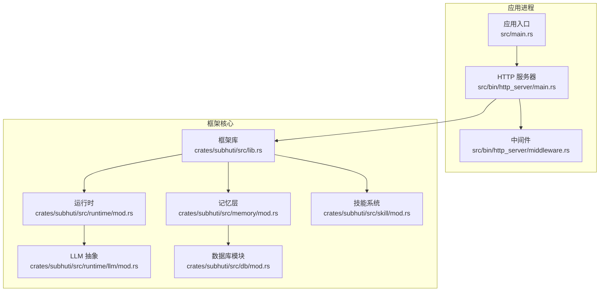
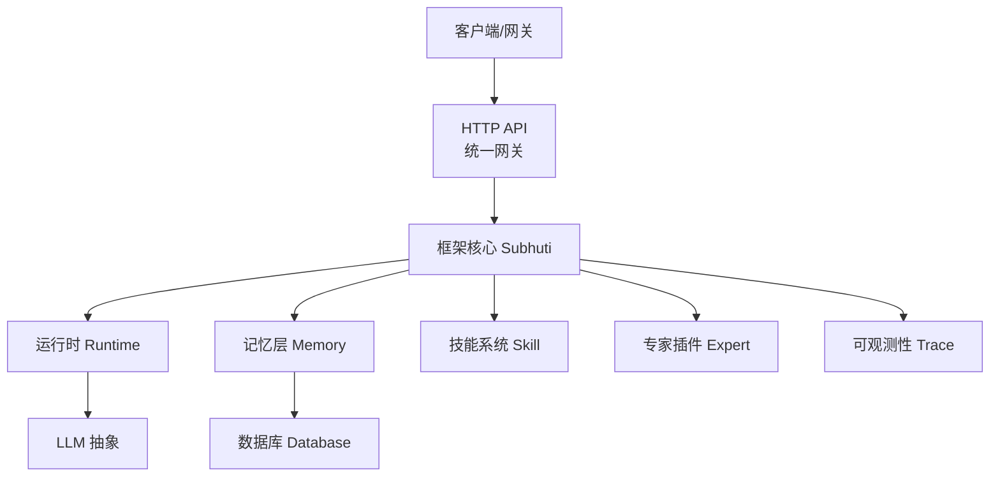
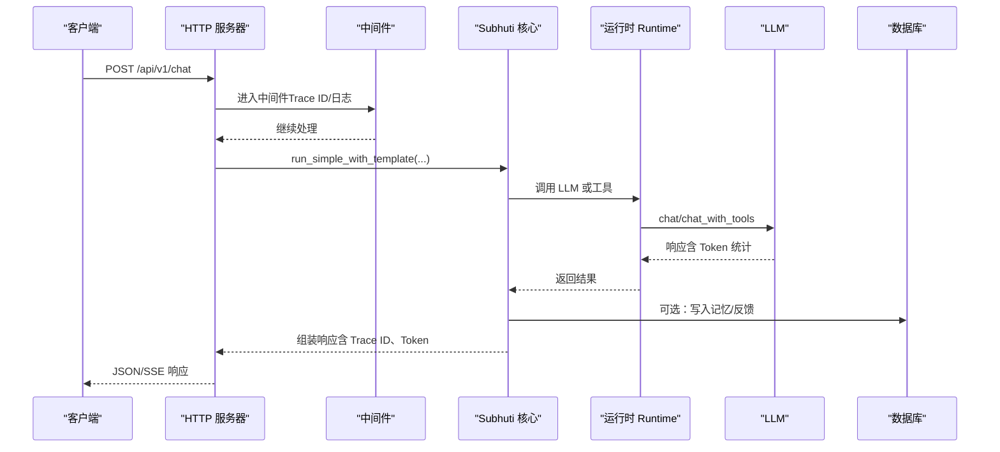
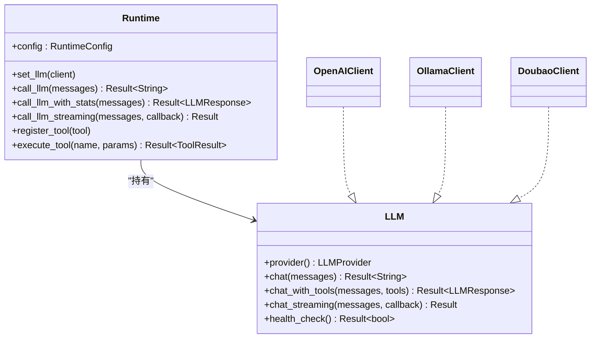
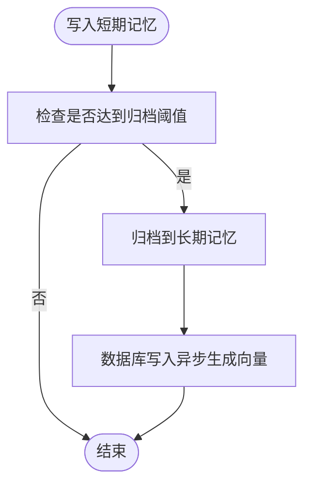
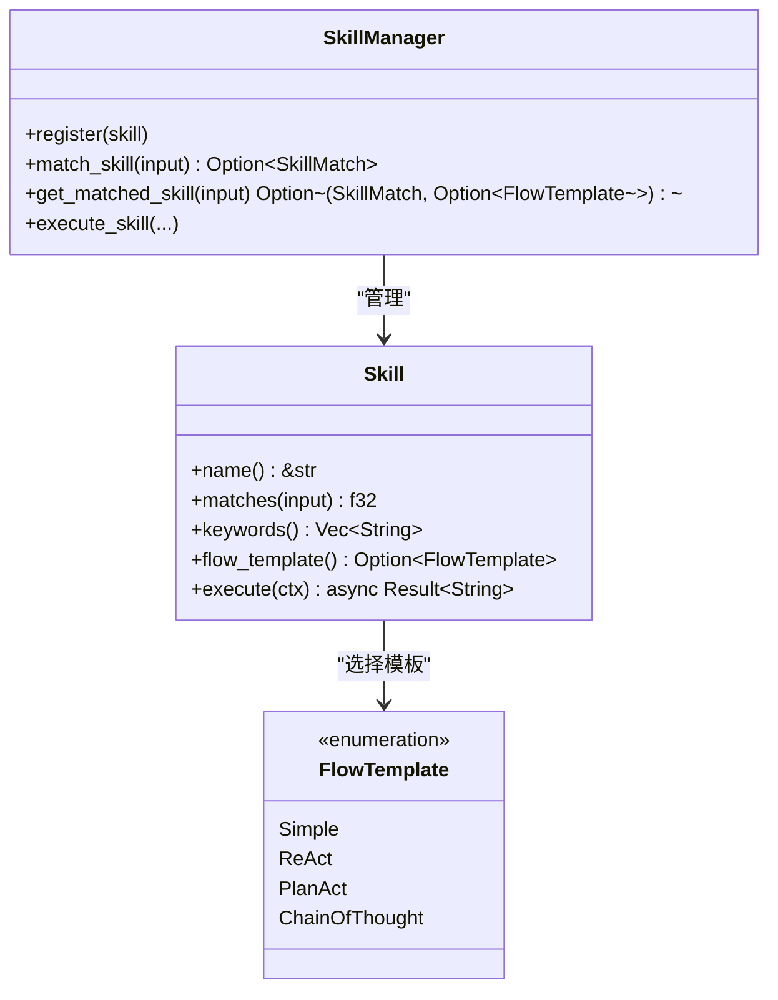
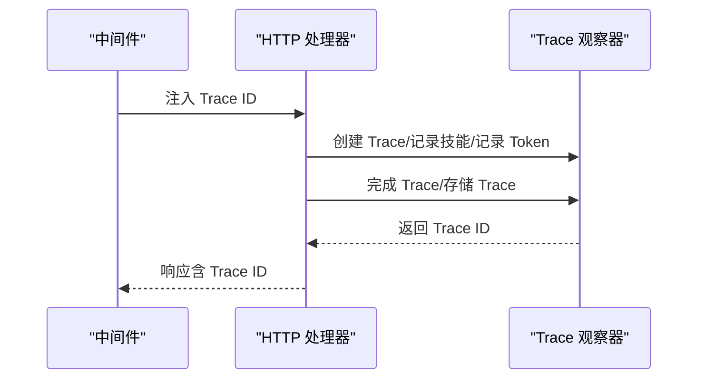
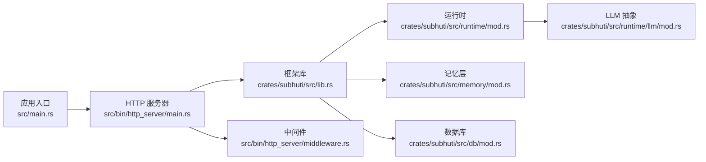

# 部署与运维

<cite>
**本文引用的文件**
- [Cargo.toml](file://Cargo.toml)
- [crates/subhuti/Cargo.toml](file://crates/subhuti/Cargo.toml)
- [src/main.rs](file://src/main.rs)
- [src/bin/http_server/main.rs](file://src/bin/http_server/main.rs)
- [src/bin/http_server/middleware.rs](file://src/bin/http_server/middleware.rs)
- [crates/subhuti/src/lib.rs](file://crates/subhuti/src/lib.rs)
- [crates/subhuti/src/runtime/mod.rs](file://crates/subhuti/src/runtime/mod.rs)
- [crates/subhuti/src/runtime/llm/mod.rs](file://crates/subhuti/src/runtime/llm/mod.rs)
- [crates/subhuti/src/memory/mod.rs](file://crates/subhuti/src/memory/mod.rs)
- [crates/subhuti/src/db/mod.rs](file://crates/subhuti/src/db/mod.rs)
- [crates/subhuti/src/skill/mod.rs](file://crates/subhuti/src/skill/mod.rs)
- [data/persona.json](file://data/persona.json)
</cite>

## 目录
1. [简介](#简介)
2. [项目结构](#项目结构)
3. [核心组件](#核心组件)
4. [架构总览](#架构总览)
5. [详细组件分析](#详细组件分析)
6. [依赖关系分析](#依赖关系分析)
7. [性能考虑](#性能考虑)
8. [故障排除指南](#故障排除指南)
9. [结论](#结论)
10. [附录](#附录)

## 简介
本文件面向生产环境的 Subhuti 框架部署与运维，覆盖容器化与编排、负载均衡、性能优化、监控与日志、故障排查、备份恢复、版本升级与安全加固、CI/CD 与灰度发布策略，以及运维团队职责分工。文档基于仓库现有源码与配置进行分析，确保方案可落地、可验证。

## 项目结构
- 工作区采用 Rust 多包结构，根 Cargo.toml 定义工作区成员与二进制入口，核心框架位于 crates/subhuti，应用入口位于 src/bin/http_server。
- HTTP 服务器基于 Axum，提供统一网关 API；运行时集成 LLM、工具系统、记忆与数据库；支持专家插件扩展与可观测性追踪。
- 数据持久化使用 PostgreSQL（可选），并提供嵌入向量支持；日志同时输出至控制台与文件。

**图示来源**
- [src/bin/http_server/main.rs:1-120](file://src/bin/http_server/main.rs#L1-L120)
- [src/bin/http_server/middleware.rs:1-120](file://src/bin/http_server/middleware.rs#L1-L120)
- [crates/subhuti/src/lib.rs:1-120](file://crates/subhuti/src/lib.rs#L1-L120)
- [crates/subhuti/src/runtime/mod.rs:1-120](file://crates/subhuti/src/runtime/mod.rs#L1-L120)
- [crates/subhuti/src/runtime/llm/mod.rs:1-120](file://crates/subhuti/src/runtime/llm/mod.rs#L1-L120)
- [crates/subhuti/src/memory/mod.rs:1-120](file://crates/subhuti/src/memory/mod.rs#L1-L120)
- [crates/subhuti/src/db/mod.rs:1-120](file://crates/subhuti/src/db/mod.rs#L1-L120)
- [crates/subhuti/src/skill/mod.rs:1-120](file://crates/subhuti/src/skill/mod.rs#L1-L120)

**章节来源**
- [Cargo.toml:1-58](file://Cargo.toml#L1-L58)
- [src/main.rs:1-71](file://src/main.rs#L1-L71)

## 核心组件
- HTTP 服务器与中间件：提供统一 API、CORS、SSE 流式输出、Trace ID 与请求日志中间件。
- 框架核心（Subhuti）：统一配置、运行时、记忆、技能、专家插件与可观测性。
- 运行时（Runtime）：LLM 客户端抽象、工具系统、约束与会话管理。
- 记忆层（Memory）：短期/长期/知识库三层记忆，支持向量检索与数据库双写。
- 数据库（Database）：PostgreSQL 连接池、表结构初始化、向量索引与迁移。
- 技能系统（Skill）：关键词索引优化的匹配器，支持多种流程模板。
- LLM 抽象：OpenAI/Ollama/Doubao/自定义客户端，统一消息格式与重试机制。

**章节来源**
- [src/bin/http_server/main.rs:360-560](file://src/bin/http_server/main.rs#L360-L560)
- [crates/subhuti/src/lib.rs:84-220](file://crates/subhuti/src/lib.rs#L84-L220)
- [crates/subhuti/src/runtime/mod.rs:30-120](file://crates/subhuti/src/runtime/mod.rs#L30-L120)
- [crates/subhuti/src/memory/mod.rs:30-120](file://crates/subhuti/src/memory/mod.rs#L30-L120)
- [crates/subhuti/src/db/mod.rs:11-60](file://crates/subhuti/src/db/mod.rs#L11-L60)
- [crates/subhuti/src/skill/mod.rs:450-560](file://crates/subhuti/src/skill/mod.rs#L450-L560)
- [crates/subhuti/src/runtime/llm/mod.rs:83-148](file://crates/subhuti/src/runtime/llm/mod.rs#L83-L148)

## 架构总览
Subhuti 采用“统一网关 + 框架核心”的分层架构。HTTP 层负责接入与流式输出，框架层负责调度、记忆与技能编排，运行时层负责 LLM 与工具调用，存储层负责持久化与向量检索。

**图示来源**
- [src/bin/http_server/main.rs:360-485](file://src/bin/http_server/main.rs#L360-L485)
- [crates/subhuti/src/lib.rs:84-220](file://crates/subhuti/src/lib.rs#L84-L220)
- [crates/subhuti/src/runtime/mod.rs:57-120](file://crates/subhuti/src/runtime/mod.rs#L57-L120)
- [crates/subhuti/src/memory/mod.rs:163-240](file://crates/subhuti/src/memory/mod.rs#L163-L240)
- [crates/subhuti/src/db/mod.rs:44-80](file://crates/subhuti/src/db/mod.rs#L44-L80)
- [crates/subhuti/src/skill/mod.rs:450-520](file://crates/subhuti/src/skill/mod.rs#L450-L520)

## 详细组件分析

### HTTP 服务器与中间件
- 统一网关：提供 /api/v1/chat、/api/v1/skills、/api/v1/health 等端点；支持 SSE 流式输出。
- 中间件：Trace ID 生成与透传、请求日志记录；日志同时输出到控制台与文件。
- 健康检查：返回性格快照与统计信息，便于编排系统探活。

**图示来源**
- [src/bin/http_server/main.rs:398-485](file://src/bin/http_server/main.rs#L398-L485)
- [src/bin/http_server/middleware.rs:53-81](file://src/bin/http_server/middleware.rs#L53-L81)
- [crates/subhuti/src/runtime/mod.rs:146-174](file://crates/subhuti/src/runtime/mod.rs#L146-L174)

**章节来源**
- [src/bin/http_server/main.rs:119-206](file://src/bin/http_server/main.rs#L119-L206)
- [src/bin/http_server/middleware.rs:15-82](file://src/bin/http_server/middleware.rs#L15-L82)

### 运行时与 LLM 抽象
- 运行时配置：最大工具轮次、上下文 token 限制、超时、默认 temperature/max_tokens。
- LLM 客户端：OpenAI/Ollama/Doubao/自定义；统一消息格式与工具调用；支持流式输出与重试。
- 工具系统：极简 Tool Trait，注册后由 LLM 调用；支持流式输出回调。

**图示来源**
- [crates/subhuti/src/runtime/mod.rs:57-259](file://crates/subhuti/src/runtime/mod.rs#L57-L259)
- [crates/subhuti/src/runtime/llm/mod.rs:124-148](file://crates/subhuti/src/runtime/llm/mod.rs#L124-L148)

**章节来源**
- [crates/subhuti/src/runtime/mod.rs:30-120](file://crates/subhuti/src/runtime/mod.rs#L30-L120)
- [crates/subhuti/src/runtime/llm/mod.rs:83-148](file://crates/subhuti/src/runtime/llm/mod.rs#L83-L148)

### 记忆层与数据库
- 记忆三层：短期工作记忆、长期归档记忆、知识库语义记忆；支持 TTL、滑动窗口与归档。
- 数据库：PostgreSQL 连接池、表结构初始化、pgvector 向量索引、迁移与查询。
- 双写策略：短期记忆写入数据库并异步生成向量；长期记忆归档同步持久化。

**图示来源**
- [crates/subhuti/src/memory/mod.rs:260-333](file://crates/subhuti/src/memory/mod.rs#L260-L333)
- [crates/subhuti/src/db/mod.rs:418-490](file://crates/subhuti/src/db/mod.rs#L418-L490)

**章节来源**
- [crates/subhuti/src/memory/mod.rs:30-120](file://crates/subhuti/src/memory/mod.rs#L30-L120)
- [crates/subhuti/src/db/mod.rs:65-180](file://crates/subhuti/src/db/mod.rs#L65-L180)

### 技能系统与专家插件
- 技能匹配：关键词倒排索引 + 精确匹配度；支持优先级与阈值；无匹配时可回退默认聊天。
- 流程模板：Simple/ReAct/PlanAct/ChainOfThought；Skill 可选择模板或完全自定义。
- 专家插件：安装/启用/停用/激活，动态注入技能与知识库。

**图示来源**
- [crates/subhuti/src/skill/mod.rs:450-800](file://crates/subhuti/src/skill/mod.rs#L450-L800)

**章节来源**
- [crates/subhuti/src/skill/mod.rs:450-690](file://crates/subhuti/src/skill/mod.rs#L450-L690)

### 可观测性与追踪
- Trace ID：中间件生成并透传；HTTP 响应头与日志字段一致。
- Trace 观察：记录技能匹配、LLM Token 消耗、错误 Span；失败也落盘。
- 日志：控制台彩色输出 + 文件 JSON 输出；按环境变量过滤级别。

**图示来源**
- [src/bin/http_server/middleware.rs:53-81](file://src/bin/http_server/middleware.rs#L53-L81)
- [src/bin/http_server/main.rs:402-485](file://src/bin/http_server/main.rs#L402-L485)

**章节来源**
- [src/bin/http_server/middleware.rs:174-223](file://src/bin/http_server/middleware.rs#L174-L223)
- [src/bin/http_server/main.rs:402-485](file://src/bin/http_server/main.rs#L402-L485)

## 依赖关系分析
- 依赖栈：Tokio 异步运行时、Axum/Tower、Tracing、SQLx、Reqwest、Serde、UUID、Futures 等。
- 框架依赖：Tokio、Serde、sqlx、chrono、tracing、uuid、reqwest、clap、dotenvy 等。
- 关键耦合：HTTP 服务器依赖框架库；框架库依赖运行时、记忆、数据库；运行时依赖 LLM 客户端。

**图示来源**
- [Cargo.toml:25-58](file://Cargo.toml#L25-L58)
- [crates/subhuti/Cargo.toml:14-54](file://crates/subhuti/Cargo.toml#L14-L54)

**章节来源**
- [Cargo.toml:25-58](file://Cargo.toml#L25-L58)
- [crates/subhuti/Cargo.toml:14-54](file://crates/subhuti/Cargo.toml#L14-L54)

## 性能考虑
- 并发与流式
  - 使用 Tokio 全功能特性与 mpsc channel 实现 SSE 流式输出，避免阻塞主线程。
  - 运行时支持 LLM 流式回调，边生成边输出，降低首字节延迟。
- 数据库连接池
  - 使用 SQLx PgPool，通过 DbConfig.max_connections 控制连接上限；建议按 QPS 与峰值并发设置。
  - 启用 pgvector 扩展与必要索引，减少向量相似度检索开销。
- 记忆与检索
  - 短期记忆容量与归档阈值需平衡响应速度与上下文长度；超过阈值自动归档。
  - 向量检索开启时，建议预热 embedding 服务（如 Ollama），并合理设置维度。
- LLM 与工具
  - 通过 RuntimeConfig 限制最大轮次与上下文 token，防止资源滥用。
  - 工具调用与 LLM 调用分离，工具失败不影响主流程，必要时降级为默认聊天。
- 日志与追踪
  - 控制台与文件双输出，生产环境建议降低日志级别，避免 IO 放大。
  - Trace ID 便于跨服务串联，建议在网关层透传。

**章节来源**
- [src/bin/http_server/main.rs:487-551](file://src/bin/http_server/main.rs#L487-L551)
- [crates/subhuti/src/runtime/mod.rs:30-55](file://crates/subhuti/src/runtime/mod.rs#L30-L55)
- [crates/subhuti/src/db/mod.rs:11-42](file://crates/subhuti/src/db/mod.rs#L11-L42)
- [crates/subhuti/src/memory/mod.rs:30-52](file://crates/subhuti/src/memory/mod.rs#L30-L52)

## 故障排除指南
- 常见问题
  - LLM 未配置：运行时调用 LLM 将报错“No LLM client configured”，需在启动时设置 Provider 与配置。
  - 数据库不可用：初始化表结构失败或连接池耗尽，检查连接字符串与 max_connections。
  - 向量检索异常：确认 pgvector 已启用、索引存在、embedding 服务可用。
  - 技能未匹配：检查关键词索引与匹配阈值；必要时启用默认聊天回退。
- 性能瓶颈
  - 高延迟：检查 LLM 调用耗时、工具调用耗时与 Token 统计；优化 prompt 与上下文长度。
  - 内存增长：短期记忆未及时归档或 TTL 未生效，调整容量与 TTL。
- 错误日志解读
  - 中间件日志包含 trace_id、方法、路径、状态码与耗时；结合 Trace 观察器定位具体环节。
  - 数据库错误：关注迁移失败、索引缺失、连接池耗尽等；修复后重试初始化。
- 快速恢复
  - 重启服务：确保数据库连接池与 embedding 服务正常。
  - 降级策略：关闭向量检索或禁用专家插件，优先保证默认聊天可用。

**章节来源**
- [crates/subhuti/src/runtime/mod.rs:146-174](file://crates/subhuti/src/runtime/mod.rs#L146-L174)
- [crates/subhuti/src/db/mod.rs:65-180](file://crates/subhuti/src/db/mod.rs#L65-L180)
- [crates/subhuti/src/skill/mod.rs:610-653](file://crates/subhuti/src/skill/mod.rs#L610-L653)
- [src/bin/http_server/middleware.rs:154-171](file://src/bin/http_server/middleware.rs#L154-L171)

## 结论
Subhuti 框架具备清晰的分层架构与完善的可观测性，适合在生产环境中通过容器化与编排进行弹性部署。通过合理的数据库连接池、缓存与并发控制策略，可有效提升吞吐与稳定性。建议配合完善的监控与日志体系、备份恢复与灰度发布流程，持续保障线上质量。

## 附录

### 生产部署策略
- 容器化
  - 使用官方镜像或自编译二进制，暴露 HTTP 端口；挂载日志目录与可选配置文件。
  - 建议将 LLM API Key、数据库连接等敏感信息通过环境变量注入。
- 编排与扩缩容
  - Kubernetes：Deployment + HPA；健康检查使用 /api/v1/health；持久化日志与数据卷。
  - 负载均衡：Ingress/NLB 健康检查与会话亲和（可选）。
- 网络与安全
  - 限制入站访问，仅开放必要的 API 端口；TLS 终止于网关。
  - 通过 RBAC 限制 Pod 权限，最小化权限原则。

### 性能优化要点
- 数据库连接池：按峰值并发设置 max_connections，启用连接复用与超时控制。
- 缓存策略：短期记忆优先驻留内存；向量检索可结合 Redis 缓存热门查询结果。
- 并发控制：限制每实例并发请求数，避免 LLM 与工具调用成为瓶颈。
- 内存管理：定期触发遗忘周期，控制长期记忆规模；设置 TTL 自动清理过期数据。

### 监控与日志
- 指标采集：暴露 HTTP 服务器指标（QPS、P95/P99 延迟、错误率）；记录 Token 统计与 Trace 时延。
- 日志聚合：集中收集 JSON 日志，按 trace_id 建立关联；设置告警阈值。
- 告警配置：针对数据库连接失败、LLM 调用超时、Trace 异常、健康检查失败等事件告警。
- 性能分析：结合 Trace ID 串联链路，定位慢调用与热点技能。

### 备份与恢复
- 数据库备份：定期逻辑/物理备份，验证恢复流程；迁移时注意 pgvector 列维度一致性。
- 配置备份：记录 DbConfig、LLMConfig、RuntimeConfig 等关键配置；变更走变更管理。
- 恢复演练：定期进行故障演练，验证从备份恢复与滚动升级流程。

### 版本升级与灰度发布
- 升级流程：蓝绿/金丝雀发布，逐步切换流量；升级前后对比健康检查与关键指标。
- 回滚策略：快速回滚至上一稳定版本，保留最近一次备份。
- 自动化：CI/CD 流水线自动构建镜像、推送制品、触发编排更新。

### 安全加固
- 最小权限：Pod 与数据库账号最小权限；禁用不必要的网络访问。
- 传输加密：TLS 终止于网关；内部服务间通信加密。
- 输入校验：对外接口增加参数校验与速率限制；对 LLM prompt 做安全过滤。
- 审计日志：记录关键操作与异常行为，满足合规要求。

### CI/CD 与自动化测试
- 测试：单元测试、集成测试与性能测试；关键路径加入自动化回归。
- 构建：多阶段构建，精简镜像体积；缓存 Cargo 依赖加速构建。
- 发布：自动化打包、镜像扫描、制品库管理与编排部署。