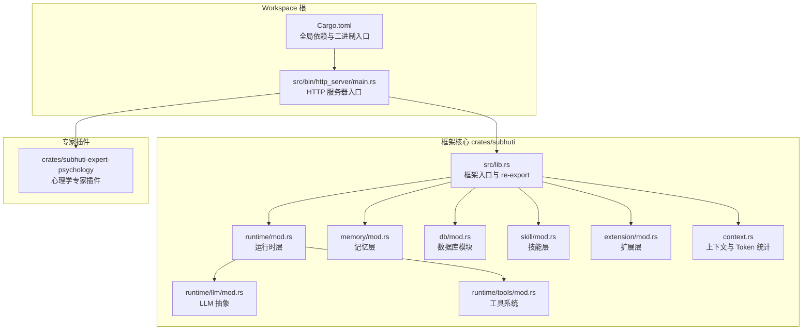
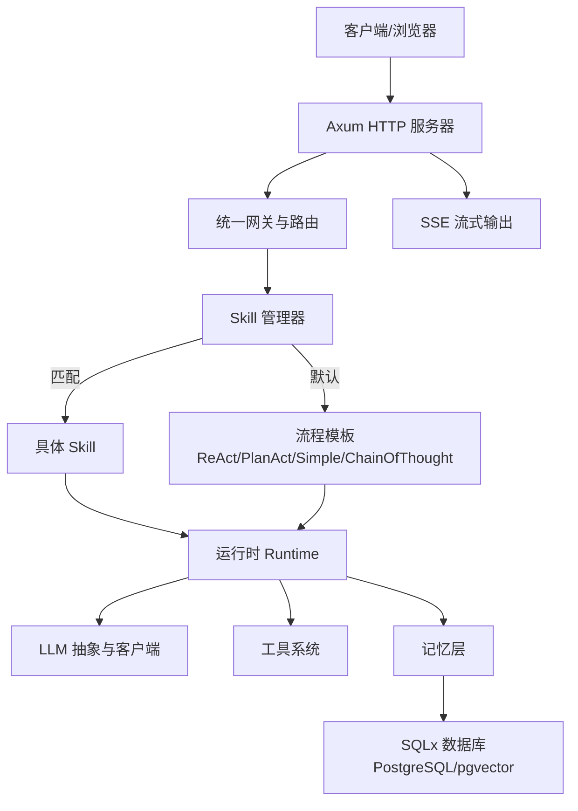
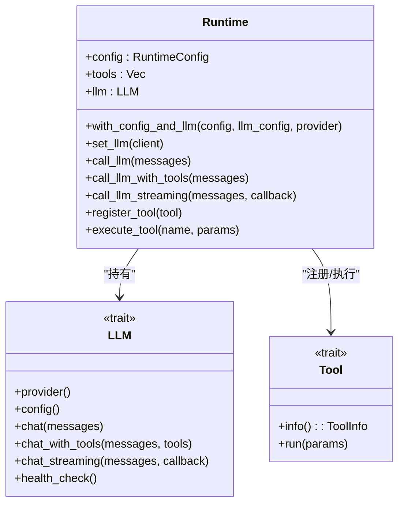
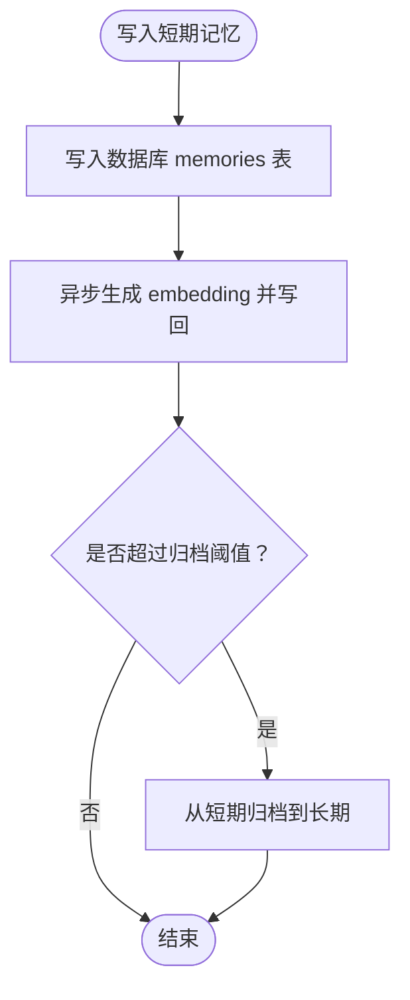
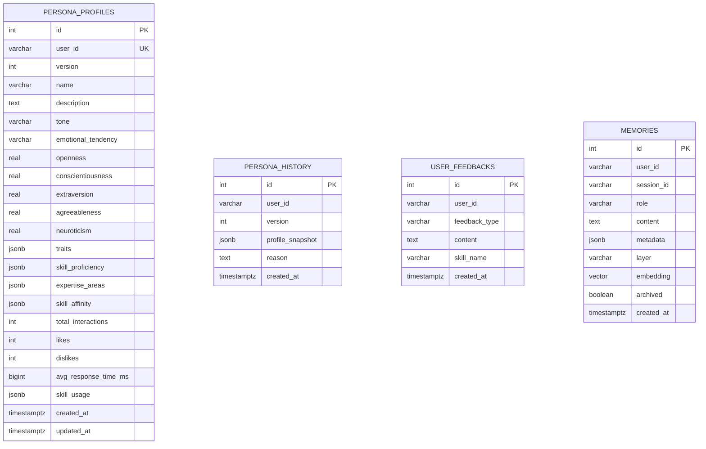
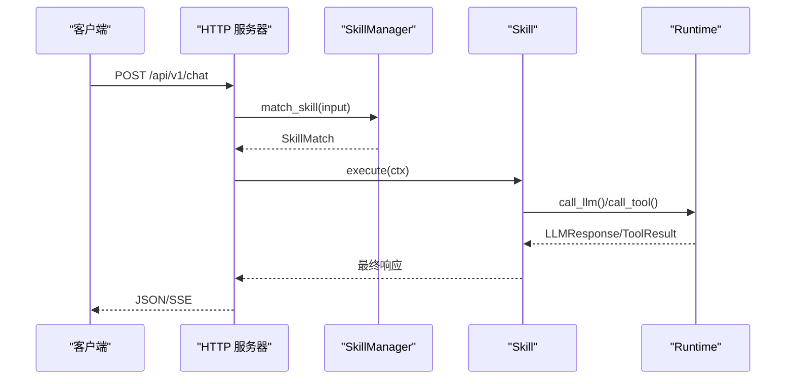
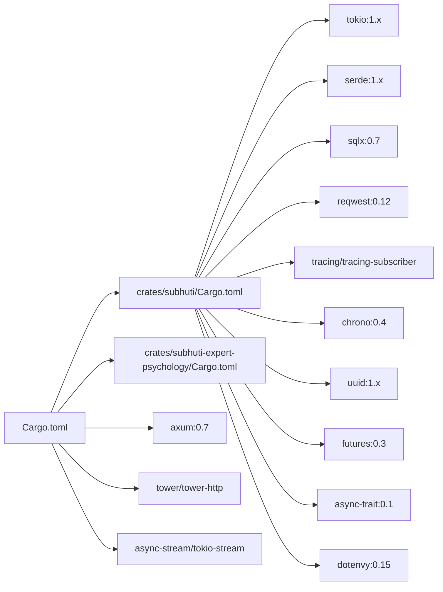

# 技术栈概览

<cite>
**本文档引用的文件**
- [Cargo.toml](file://Cargo.toml)
- [crates/subhuti/Cargo.toml](file://crates/subhuti/Cargo.toml)
- [crates/subhuti/src/lib.rs](file://crates/subhuti/src/lib.rs)
- [crates/subhuti/src/db/mod.rs](file://crates/subhuti/src/db/mod.rs)
- [crates/subhuti/src/runtime/mod.rs](file://crates/subhuti/src/runtime/mod.rs)
- [crates/subhuti/src/runtime/llm/mod.rs](file://crates/subhuti/src/runtime/llm/mod.rs)
- [crates/subhuti/src/runtime/tools/mod.rs](file://crates/subhuti/src/runtime/tools/mod.rs)
- [crates/subhuti/src/memory/mod.rs](file://crates/subhuti/src/memory/mod.rs)
- [crates/subhuti/src/context.rs](file://crates/subhuti/src/context.rs)
- [crates/subhuti/src/skill/mod.rs](file://crates/subhuti/src/skill/mod.rs)
- [crates/subhuti/src/extension/mod.rs](file://crates/subhuti/src/extension/mod.rs)
- [crates/subhuti/data/persona.json](file://crates/subhuti/data/persona.json)
- [src/bin/http_server/main.rs](file://src/bin/http_server/main.rs)
</cite>

## 目录
1. [简介](#简介)
2. [项目结构](#项目结构)
3. [核心技术栈](#核心技术栈)
4. [架构总览](#架构总览)
5. [组件深度分析](#组件深度分析)
6. [依赖关系分析](#依赖关系分析)
7. [性能考量](#性能考量)
8. [故障排查指南](#故障排查指南)
9. [结论](#结论)

## 简介
本文件面向 Subhuti AI Agent 框架的技术栈概览，系统梳理项目所采用的核心技术与依赖库，解释技术选型理由、组件协作关系、版本与兼容性要求以及性能特点。文档既为初学者提供 Rust 生态入门背景，也为经验开发者提供深入的实现细节与最佳实践建议。

## 项目结构
项目采用多 crate 的 Workspace 组织方式，核心框架位于 crates/subhuti，应用入口位于根目录的 Cargo.toml 与 src/bin/http_server/main.rs。整体结构如下：

- Workspace 根：定义工作区成员与全局依赖
- crates/subhuti：框架核心库，包含运行时、记忆、技能、扩展、数据库等模块
- crates/subhuti-expert-psychology：专家插件示例
- src/bin/http_server：基于 Axum 的 HTTP 服务器入口
- data/static/docs：文档与静态资源

**图表来源**
- [Cargo.toml:1-58](file://Cargo.toml#L1-L58)
- [crates/subhuti/Cargo.toml:1-63](file://crates/subhuti/Cargo.toml#L1-L63)
- [src/bin/http_server/main.rs:1-120](file://src/bin/http_server/main.rs#L1-L120)

**章节来源**
- [Cargo.toml:1-58](file://Cargo.toml#L1-L58)
- [crates/subhuti/Cargo.toml:1-63](file://crates/subhuti/Cargo.toml#L1-L63)
- [src/bin/http_server/main.rs:1-120](file://src/bin/http_server/main.rs#L1-L120)

## 核心技术栈

### 异步运行时：Tokio
- 版本与特性：1.x，启用 features = ["full"]
- 作用：提供异步运行时、任务调度、通道与定时器；贯穿框架的异步执行路径
- 适用范围：运行时、内存异步写入、HTTP 服务器、工具与 LLM 的异步调用

**章节来源**
- [Cargo.toml:28](file://Cargo.toml#L28)
- [crates/subhuti/Cargo.toml:16](file://crates/subhuti/Cargo.toml#L16)
- [crates/subhuti/src/memory/mod.rs:277](file://crates/subhuti/src/memory/mod.rs#L277-L311)

### Web 框架：Axum
- 版本与特性：0.7，启用 features = ["macros"]
- 作用：HTTP 服务器与路由，提供统一网关、SSE 流式输出、中间件与 CORS
- 适用范围：HTTP 服务器入口、API 路由、SSE 流式响应

**章节来源**
- [Cargo.toml:39](file://Cargo.toml#L39)
- [src/bin/http_server/main.rs:20-31](file://src/bin/http_server/main.rs#L20-L31)
- [src/bin/http_server/main.rs:490-551](file://src/bin/http_server/main.rs#L490-L551)

### 数据库访问：SQLx
- 版本与特性：0.7，启用 features = ["runtime-tokio-native-tls", "postgres", "chrono", "uuid", "json"]
- 作用：PostgreSQL 连接池、表结构初始化、向量扩展 pgvector、CRUD 操作
- 适用范围：持久化记忆、用户画像、反馈与历史记录

**章节来源**
- [crates/subhuti/Cargo.toml:23](file://crates/subhuti/Cargo.toml#L23)
- [crates/subhuti/src/db/mod.rs:11-42](file://crates/subhuti/src/db/mod.rs#L11-L42)
- [crates/subhuti/src/db/mod.rs:66-180](file://crates/subhuti/src/db/mod.rs#L66-L180)

### 序列化：Serde
- 版本与特性：1.x，启用 features = ["derive"]
- 作用：结构化数据序列化/反序列化，配合 serde_json 进行 JSON 交互
- 适用范围：配置、消息、响应、数据库 JSON 字段

**章节来源**
- [Cargo.toml:34](file://Cargo.toml#L34)
- [crates/subhuti/Cargo.toml:19-20](file://crates/subhuti/Cargo.toml#L19-L20)
- [crates/subhuti/src/db/mod.rs:607-628](file://crates/subhuti/src/db/mod.rs#L607-L628)

### HTTP 客户端：reqwest
- 版本与特性：0.12，启用 features = ["json"]
- 作用：调用外部 LLM API（OpenAI/Ollama/Doubao），支持 JSON 请求/响应
- 适用范围：LLM 客户端实现与外部 API 通信

**章节来源**
- [Cargo.toml:45](file://Cargo.toml#L45)
- [crates/subhuti/Cargo.toml:47](file://crates/subhuti/Cargo.toml#L47)

### 日志与可观测性：tracing/tracing-subscriber/tracing-appender
- 版本与特性：tracing 0.1；tracing-subscriber 0.3（启用 env-filter、fmt、json）；tracing-appender 0.2
- 作用：结构化日志、环境变量过滤、文件追加、SSE Trace 追踪
- 适用范围：框架日志、HTTP 服务器日志、Trace 追踪

**章节来源**
- [Cargo.toml:29-31](file://Cargo.toml#L29-L31)
- [crates/subhuti/src/context.rs:1-87](file://crates/subhuti/src/context.rs#L1-L87)
- [src/bin/http_server/main.rs:402-485](file://src/bin/http_server/main.rs#L402-L485)

### 工具库：futures、async-trait、uuid、chrono、dotenvy、anyhow、bincode
- 作用：异步组合、trait 异步抽象、唯一 ID、时间日期、环境变量、错误处理、向量编码
- 适用范围：异步任务、工具系统、UUID 标识、时间戳、配置加载、错误传播、向量存储

**章节来源**
- [Cargo.toml:32-33](file://Cargo.toml#L32-L33)
- [Cargo.toml:48](file://Cargo.toml#L48)
- [Cargo.toml:54](file://Cargo.toml#L54)
- [Cargo.toml:29](file://Cargo.toml#L29)
- [Cargo.toml:39](file://Cargo.toml#L39)
- [crates/subhuti/Cargo.toml:26](file://crates/subhuti/Cargo.toml#L26)
- [crates/subhuti/Cargo.toml:36](file://crates/subhuti/Cargo.toml#L36)
- [crates/subhuti/Cargo.toml:29](file://crates/subhuti/Cargo.toml#L29)
- [crates/subhuti/Cargo.toml:53](file://crates/subhuti/Cargo.toml#L53)

### SSE 支持：async-stream、tokio-stream
- 作用：Server-Sent Events 流式输出，结合 mpsc channel 实现流式响应
- 适用范围：HTTP 流式聊天输出

**章节来源**
- [Cargo.toml:57-58](file://Cargo.toml#L57-L58)
- [src/bin/http_server/main.rs:490-551](file://src/bin/http_server/main.rs#L490-L551)

## 架构总览
Subhuti 采用“四层架构”：Memory（记忆）、Runtime（运行时/LLM/工具）、Flow（ReAct/PlanAct 等流程）、Extension（Hook 扩展）。HTTP 服务器作为统一网关，将请求路由至 Skill 或默认流程，并通过 SSE 提供流式输出。

**图表来源**
- [src/bin/http_server/main.rs:364-485](file://src/bin/http_server/main.rs#L364-L485)
- [crates/subhuti/src/skill/mod.rs:451-800](file://crates/subhuti/src/skill/mod.rs#L451-L800)
- [crates/subhuti/src/runtime/mod.rs:57-259](file://crates/subhuti/src/runtime/mod.rs#L57-L259)
- [crates/subhuti/src/memory/mod.rs:164-444](file://crates/subhuti/src/memory/mod.rs#L164-L444)
- [crates/subhuti/src/db/mod.rs:44-603](file://crates/subhuti/src/db/mod.rs#L44-L603)

## 组件深度分析

### 运行时层（Runtime）
- 职责：统一 LLM 客户端、工具注册与执行、约束护栏（最大轮次、超时、上下文长度）
- 关键点：
  - LLM 客户端工厂：根据 Provider 自动创建 OpenAI/Ollama/Doubao/Custom
  - 工具系统：注册 Tool Trait，统一参数 Schema 与执行
  - Token 统计：在调用 LLM 时累加 prompt/completion/total tokens
  - 流式输出：支持回调式流式输出

**图表来源**
- [crates/subhuti/src/runtime/mod.rs:57-259](file://crates/subhuti/src/runtime/mod.rs#L57-L259)
- [crates/subhuti/src/runtime/llm/mod.rs:124-148](file://crates/subhuti/src/runtime/llm/mod.rs#L124-L148)
- [crates/subhuti/src/runtime/tools/mod.rs:53-61](file://crates/subhuti/src/runtime/tools/mod.rs#L53-L61)

**章节来源**
- [crates/subhuti/src/runtime/mod.rs:30-117](file://crates/subhuti/src/runtime/mod.rs#L30-L117)
- [crates/subhuti/src/runtime/llm/mod.rs:124-201](file://crates/subhuti/src/runtime/llm/mod.rs#L124-L201)
- [crates/subhuti/src/runtime/tools/mod.rs:11-61](file://crates/subhuti/src/runtime/tools/mod.rs#L11-L61)

### 记忆层（Memory）
- 职责：短期/长期/知识库三层记忆，支持向量检索与持久化
- 关键点：
  - 双写策略：短期/长期记忆写入数据库并异步生成 embedding
  - 向量相似度搜索：基于 pgvector 的余弦距离
  - TTL 过期、滑动窗口、摘要生成

**图表来源**
- [crates/subhuti/src/memory/mod.rs:260-368](file://crates/subhuti/src/memory/mod.rs#L260-L368)
- [crates/subhuti/src/db/mod.rs:418-490](file://crates/subhuti/src/db/mod.rs#L418-L490)

**章节来源**
- [crates/subhuti/src/memory/mod.rs:164-444](file://crates/subhuti/src/memory/mod.rs#L164-L444)
- [crates/subhuti/src/db/mod.rs:138-180](file://crates/subhuti/src/db/mod.rs#L138-L180)

### 数据库模块（SQLx）
- 职责：PostgreSQL 连接池、表结构初始化、向量扩展、CRUD
- 关键点：
  - 启用 pgvector 扩展，创建 persona_profiles/memories 等表
  - 索引优化：user_id、layer、archived 等
  - 向量搜索：embedding 列与余弦距离排序

**图表来源**
- [crates/subhuti/src/db/mod.rs:74-177](file://crates/subhuti/src/db/mod.rs#L74-L177)
- [crates/subhuti/src/db/mod.rs:537-592](file://crates/subhuti/src/db/mod.rs#L537-L592)

**章节来源**
- [crates/subhuti/src/db/mod.rs:44-603](file://crates/subhuti/src/db/mod.rs#L44-L603)

### 技能层（Skill）
- 职责：纯代码实现的 Skill，支持预设流程模板（ReAct/PlanAct/Simple/ChainOfThought）
- 关键点：
  - 关键词索引优化：通过关键词倒排索引加速匹配
  - 流程模板选择：优先使用请求传入模板，否则使用 Skill 默认模板
  - Token 统计：通过 Arc 共享的 TokenStats 累加

**图表来源**
- [crates/subhuti/src/skill/mod.rs:451-800](file://crates/subhuti/src/skill/mod.rs#L451-L800)
- [src/bin/http_server/main.rs:398-485](file://src/bin/http_server/main.rs#L398-L485)

**章节来源**
- [crates/subhuti/src/skill/mod.rs:93-113](file://crates/subhuti/src/skill/mod.rs#L93-L113)
- [crates/subhuti/src/skill/mod.rs:256-405](file://crates/subhuti/src/skill/mod.rs#L256-L405)

### 扩展层（Extension/Hook）
- 职责：不侵入内核的插拔式扩展，提供生命周期 Hook（before_prompt/before_tool/after_tool/after_complete）
- 关键点：
  - HookPhase 分类与执行顺序
  - 内置 Hook：日志、敏感词过滤、Token 统计
  - 与 Skill/Flow 的协作：在关键节点插入横切关注点

**章节来源**
- [crates/subhuti/src/extension/mod.rs:29-227](file://crates/subhuti/src/extension/mod.rs#L29-L227)

### 上下文与 Token 统计
- 职责：RunContext 保存请求级状态（Session、Token 统计、调用链），TokenStats 累加 LLM 使用情况
- 关键点：
  - Arc + RwLock 支持跨调用共享
  - 与 SkillContext/SkillManager 协作

**章节来源**
- [crates/subhuti/src/context.rs:18-87](file://crates/subhuti/src/context.rs#L18-L87)

## 依赖关系分析

**图表来源**
- [Cargo.toml:25-58](file://Cargo.toml#L25-L58)
- [crates/subhuti/Cargo.toml:14-54](file://crates/subhuti/Cargo.toml#L14-L54)

**章节来源**
- [Cargo.toml:25-58](file://Cargo.toml#L25-L58)
- [crates/subhuti/Cargo.toml:14-54](file://crates/subhuti/Cargo.toml#L14-L54)

## 性能考量
- 异步与并发
  - Tokio 的任务调度与连接池（SQLx）提升并发吞吐
  - SSE 流式输出避免阻塞，改善用户体验
- 数据库与索引
  - pgvector 向量索引与多列索引（user_id、layer、archived）优化检索
  - 双写策略在一致性与性能之间平衡
- 记忆与检索
  - 关键词索引优化 Skill 匹配；滑动窗口与归档减少短期记忆膨胀
- 序列化与内存
  - Serde derive 降低样板代码；bincode 轻量向量序列化
- LLM 调用
  - 统一 LLM 抽象与重试机制，避免单点故障

[本节为通用性能讨论，无需特定文件引用]

## 故障排查指南
- 日志与追踪
  - 使用 tracing-subscriber 的 env-filter 控制日志级别；SSE 中记录 Trace ID 便于定位
- 数据库连接
  - 检查 PostgreSQL 连接字符串、pgvector 扩展是否启用；确认索引是否存在
- LLM 客户端
  - 校验 API Key、URL 与模型名称；必要时切换 Provider（OpenAI/Ollama/Doubao/Custom）
- 工具与技能
  - 确认工具参数 Schema 与 Skill 匹配度；检查关键词索引是否正确
- 错误处理
  - anyhow 提供统一错误传播；扩展层可插入敏感词过滤等前置校验

**章节来源**
- [src/bin/http_server/main.rs:402-485](file://src/bin/http_server/main.rs#L402-L485)
- [crates/subhuti/src/db/mod.rs:66-180](file://crates/subhuti/src/db/mod.rs#L66-L180)
- [crates/subhuti/src/extension/mod.rs:287-320](file://crates/subhuti/src/extension/mod.rs#L287-L320)

## 结论
Subhuti 以 Rust 为核心，借助 Tokio 的高性能异步运行时、Axum 的现代 Web 框架、SQLx 的强类型数据库访问与 Serde 的结构化序列化，构建了可扩展、可观测且高性能的 AI Agent 框架。通过四层架构与 Hook 扩展，框架在保持简洁的同时提供了强大的定制能力。对于初学者，建议从 HTTP 服务器入口与内置 Skill 入手；对于资深开发者，可深入扩展层、数据库与 LLM 抽象以满足复杂场景需求。