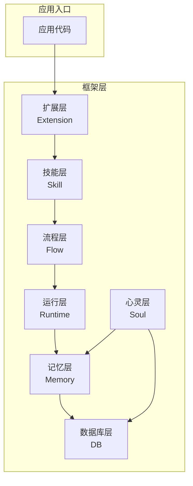
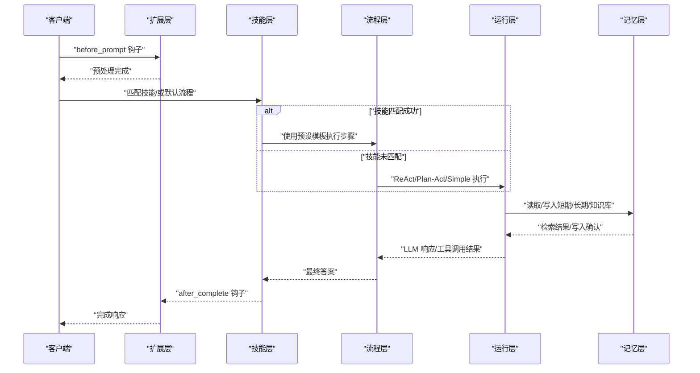
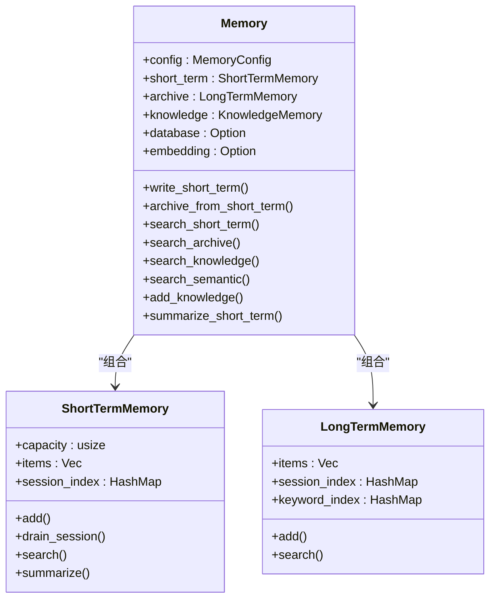
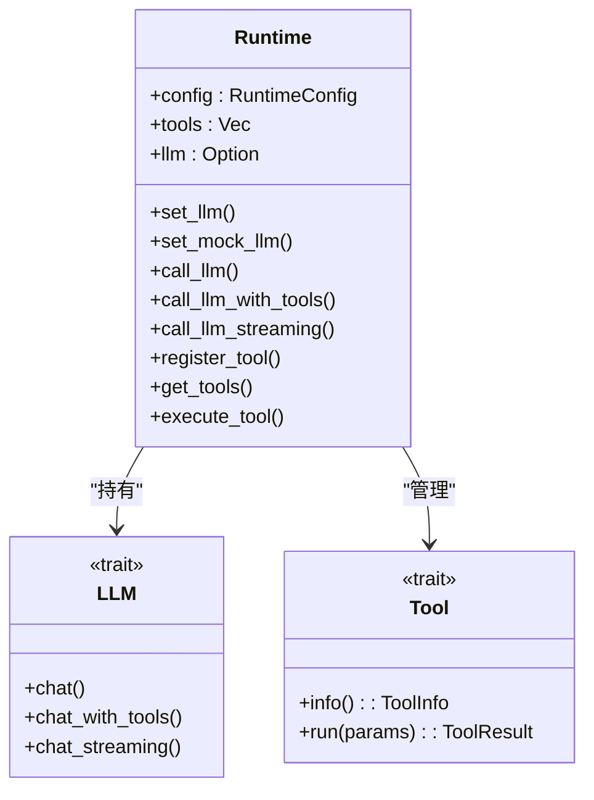
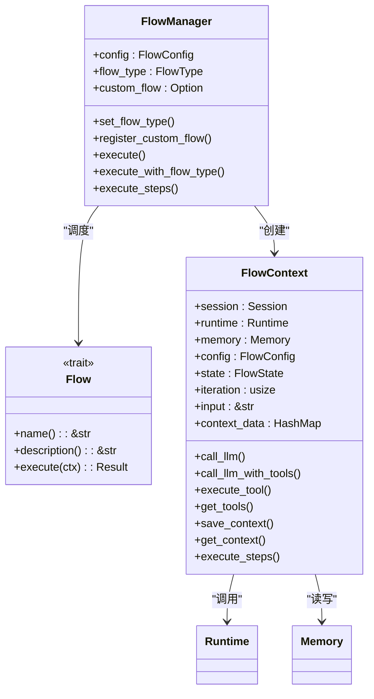
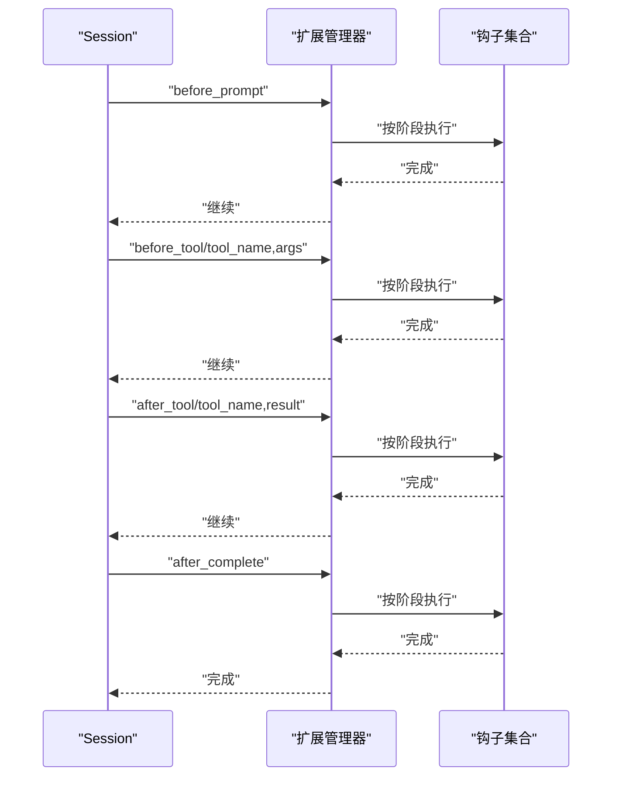
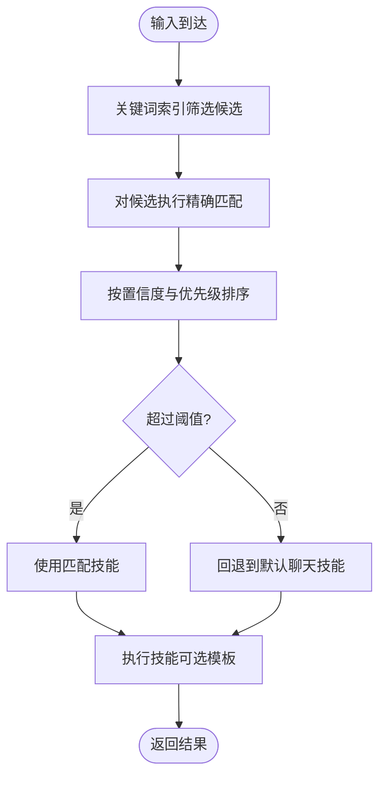
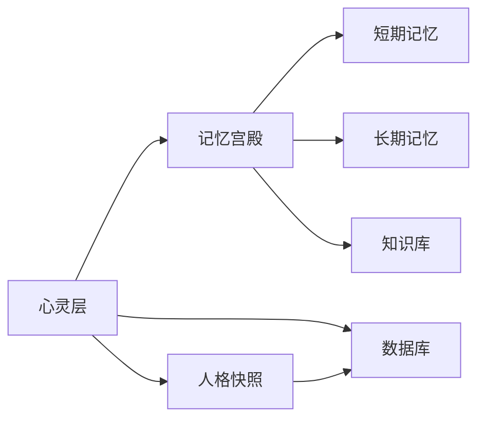
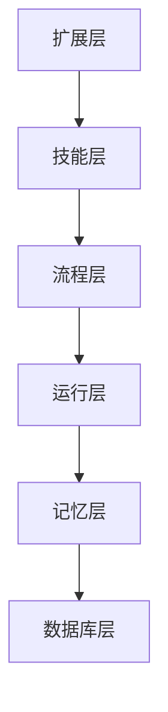

# 架构设计理念

<cite>
**本文引用的文件**
- [lib.rs](file://crates/subhuti/src/lib.rs)
- [Cargo.toml](file://crates/subhuti/Cargo.toml)
- [context.rs](file://crates/subhuti/src/context.rs)
- [mod.rs](file://crates/subhuti/src/memory/mod.rs)
- [mod.rs](file://crates/subhuti/src/runtime/mod.rs)
- [mod.rs](file://crates/subhuti/src/flow/mod.rs)
- [mod.rs](file://crates/subhuti/src/extension/mod.rs)
- [mod.rs](file://crates/subhuti/src/skill/mod.rs)
- [mod.rs](file://crates/subhuti/src/soul/mod.rs)
- [mod.rs](file://crates/subhuti/src/db/mod.rs)
- [react.rs](file://crates/subhuti/src/flow/react.rs)
- [simple.rs](file://crates/subhuti/src/flow/simple.rs)
- [plan_act.rs](file://crates/subhuti/src/flow/plan_act.rs)
- [short_term.rs](file://crates/subhuti/src/memory/short_term.rs)
- [long_term.rs](file://crates/subhuti/src/memory/long_term.rs)
</cite>

## 目录
1. [引言](#引言)
2. [项目结构](#项目结构)
3. [核心组件](#核心组件)
4. [架构总览](#架构总览)
5. [详细组件分析](#详细组件分析)
6. [依赖分析](#依赖分析)
7. [性能考虑](#性能考虑)
8. [故障排查指南](#故障排查指南)
9. [结论](#结论)
10. [附录](#附录)

## 引言
本文件面向架构师与高级开发者，系统阐述 Subhuti AI Agent 框架的“四层架构”设计理念与实现要点，围绕 Memory → Runtime → Flow → Extension 的分层组织，解释模块化与职责分离原则、组件交互与数据流、插件化扩展机制，以及安全性、可观测性与可维护性的跨领域关注点。文中提供架构图与序列图，帮助读者快速把握系统全貌与关键流程。

## 项目结构
Subhuti 采用“模块即层”的组织方式，每个目录代表一层能力，并通过统一入口对外 re-export，形成清晰的分层边界与依赖方向：
- Memory 层：记忆的三层结构（短期/长期/知识库），支持持久化与向量检索
- Runtime 层：LLM 抽象、工具系统、会话与约束护栏
- Flow 层：ReAct/Plan-Act/Simple 等流程策略，支持自定义流程
- Extension 层：Hook/中间件扩展，贯穿生命周期
- Skill 层：技能路由与匹配，支持预设流程模板
- Soul 层：动态人格与记忆宫殿，双轨演化
- DB 层：PostgreSQL 集成与 pgvector 向量检索
- Observe 层：Trace 追踪与可观测性（在扩展层中体现）

图表来源
- [lib.rs:22-46](file://crates/subhuti/src/lib.rs#L22-L46)
- [mod.rs:1-496](file://crates/subhuti/src/memory/mod.rs#L1-L496)
- [mod.rs:1-277](file://crates/subhuti/src/runtime/mod.rs#L1-L277)
- [mod.rs:1-800](file://crates/subhuti/src/flow/mod.rs#L1-L800)
- [mod.rs:1-438](file://crates/subhuti/src/extension/mod.rs#L1-L438)
- [mod.rs:1-800](file://crates/subhuti/src/skill/mod.rs#L1-L800)
- [mod.rs:1-800](file://crates/subhuti/src/soul/mod.rs#L1-L800)
- [mod.rs:1-688](file://crates/subhuti/src/db/mod.rs#L1-L688)

章节来源
- [lib.rs:1-1009](file://crates/subhuti/src/lib.rs#L1-L1009)
- [Cargo.toml:1-63](file://crates/subhuti/Cargo.toml#L1-L63)

## 核心组件
- Subhuti 主入口：聚合全局配置、记忆、运行时、流程、扩展、技能、心灵与数据库，提供 run/run_with_* 等高层 API
- RunContext：请求级上下文，承载 Session、Token 统计与调用链
- Memory：三层记忆统一管理，支持持久化与向量检索
- Runtime：LLM 抽象、工具系统、会话与约束
- Flow：流程策略管理与执行，支持 ReAct/Plan-Act/Simple 与自定义
- Extension：Hook 生命周期扩展，贯穿 before/after 各阶段
- Skill：技能匹配与执行，支持预设流程模板
- Soul：动态人格与记忆宫殿，双轨演化
- Database：PostgreSQL 集成，pgvector 向量检索

章节来源
- [lib.rs:84-107](file://crates/subhuti/src/lib.rs#L84-L107)
- [context.rs:51-87](file://crates/subhuti/src/context.rs#L51-L87)
- [mod.rs:163-444](file://crates/subhuti/src/memory/mod.rs#L163-L444)
- [mod.rs:57-259](file://crates/subhuti/src/runtime/mod.rs#L57-L259)
- [mod.rs:677-800](file://crates/subhuti/src/flow/mod.rs#L677-L800)
- [mod.rs:112-227](file://crates/subhuti/src/extension/mod.rs#L112-L227)
- [mod.rs:451-800](file://crates/subhuti/src/skill/mod.rs#L451-L800)
- [mod.rs:295-800](file://crates/subhuti/src/soul/mod.rs#L295-L800)
- [mod.rs:44-688](file://crates/subhuti/src/db/mod.rs#L44-L688)

## 架构总览
四层架构的职责与交互如下：
- Memory 层：负责数据的写入、检索、归档与持久化，向上提供搜索与摘要能力
- Runtime 层：负责真正执行，封装 LLM 与工具调用，提供约束与会话管理
- Flow 层：负责智能闭环，按策略驱动 Plan→Act→Observe→Reflect
- Extension 层：在关键生命周期注入横切能力（日志、过滤、统计等）

图表来源
- [lib.rs:655-742](file://crates/subhuti/src/lib.rs#L655-L742)
- [mod.rs:174-206](file://crates/subhuti/src/extension/mod.rs#L174-L206)
- [mod.rs:791-800](file://crates/subhuti/src/skill/mod.rs#L791-L800)
- [mod.rs:729-794](file://crates/subhuti/src/flow/mod.rs#L729-L794)
- [mod.rs:146-223](file://crates/subhuti/src/runtime/mod.rs#L146-L223)
- [mod.rs:260-407](file://crates/subhuti/src/memory/mod.rs#L260-L407)

## 详细组件分析

### 记忆层（Memory）
- 三层结构：短期工作记忆（滑动窗口）、长期归档记忆（历史沉淀）、知识库语义记忆（向量检索）
- 统一接口：MemoryStore/DatabaseStore，支持内存与持久化双写
- 持久化：PostgreSQL + pgvector，支持向量相似度检索
- 运行时能力：写入短期记忆自动归档、语义检索、知识库添加

图表来源
- [mod.rs:163-444](file://crates/subhuti/src/memory/mod.rs#L163-L444)
- [short_term.rs:10-158](file://crates/subhuti/src/memory/short_term.rs#L10-L158)
- [long_term.rs:11-129](file://crates/subhuti/src/memory/long_term.rs#L11-L129)

章节来源
- [mod.rs:1-496](file://crates/subhuti/src/memory/mod.rs#L1-L496)
- [short_term.rs:1-158](file://crates/subhuti/src/memory/short_term.rs#L1-L158)
- [long_term.rs:1-129](file://crates/subhuti/src/memory/long_term.rs#L1-L129)

### 运行层（Runtime）
- LLM 抽象：统一 Provider/Client 接口，支持 OpenAI/Ollama/Doubao/Custom
- 工具系统：极简 Tool Trait，name/desc/schema/run
- 会话与约束：Session 无状态、约束护栏（最大轮次、超时、上下文长度）
- 能力暴露：call_llm/call_llm_with_tools/streaming 等

图表来源
- [mod.rs:57-259](file://crates/subhuti/src/runtime/mod.rs#L57-L259)

章节来源
- [mod.rs:1-277](file://crates/subhuti/src/runtime/mod.rs#L1-L277)

### 流程层（Flow）
- Flow trait：标准接口，支持自定义流程
- 内置流程：Simple/React/PlanAct
- 流程模板：FlowStep 语法树，支持 Tool/Knowledge/LLM/Memory/Condition/Parallel/Loo
- 执行上下文：FlowContext，封装 Session/Runtime/Memory/配置/状态/迭代

图表来源
- [mod.rs:631-800](file://crates/subhuti/src/flow/mod.rs#L631-L800)

章节来源
- [mod.rs:1-800](file://crates/subhuti/src/flow/mod.rs#L1-L800)
- [react.rs:1-227](file://crates/subhuti/src/flow/react.rs#L1-L227)
- [simple.rs:1-72](file://crates/subhuti/src/flow/simple.rs#L1-L72)
- [plan_act.rs:1-166](file://crates/subhuti/src/flow/plan_act.rs#L1-L166)

### 扩展层（Extension）
- Hook 生命周期：BeforePrompt/BeforeTool/AfterTool/AfterComplete
- 扩展接口：Extension + Hook
- 内置扩展：日志、敏感词过滤、Token 统计
- 执行顺序：按阶段收集钩子并串行执行

图表来源
- [mod.rs:112-227](file://crates/subhuti/src/extension/mod.rs#L112-L227)

章节来源
- [mod.rs:1-438](file://crates/subhuti/src/extension/mod.rs#L1-L438)

### 技能层（Skill）
- 纯代码风格：Skill 用代码实现，无需声明式步骤
- 预设模板：Simple/ReAct/PlanAct/ChainOfThought，可选使用
- 匹配机制：关键词倒排索引 + 精确匹配 + 优先级排序
- 执行上下文：SkillContext，封装输入、Session、Runtime、Memory、Token 统计

图表来源
- [mod.rs:451-790](file://crates/subhuti/src/skill/mod.rs#L451-L790)

章节来源
- [mod.rs:1-800](file://crates/subhuti/src/skill/mod.rs#L1-L800)

### 心灵层（Soul）与记忆宫殿
- 双轨演化：统计分析轨道（实时）+ LLM 自反思轨道（周期性）
- 记忆宫殿：短期/长期/知识库 + 记忆分区 + 联想网络 + 遗忘周期
- 人格系统：大五人格、语气风格、情感倾向、技能熟练度与擅长领域
- 数据持久化：与数据库联动，支持 persona/profile/history/feedback 等表

图表来源
- [mod.rs:295-800](file://crates/subhuti/src/soul/mod.rs#L295-L800)
- [mod.rs:44-688](file://crates/subhuti/src/db/mod.rs#L44-L688)

章节来源
- [mod.rs:1-800](file://crates/subhuti/src/soul/mod.rs#L1-L800)
- [mod.rs:1-688](file://crates/subhuti/src/db/mod.rs#L1-L688)

## 依赖分析
- 模块耦合：上层仅依赖下层接口，下层不感知上层；扩展层通过 Hook 与上层解耦
- 外部依赖：Tokio 异步运行时、SQLx PostgreSQL、Tracing 日志、Reqwest LLM 调用、Bincode 向量存储、UUID/Chrono 等
- 关键依赖链：Extension → Skill → Flow → Runtime → Memory → DB

图表来源
- [Cargo.toml:14-54](file://crates/subhuti/Cargo.toml#L14-L54)

章节来源
- [Cargo.toml:1-63](file://crates/subhuti/Cargo.toml#L1-L63)

## 性能考虑
- 记忆层
  - 短期记忆采用滑动窗口与自动归档，避免上下文膨胀
  - 向量检索依赖 pgvector，需合理设置维度与索引
- 技能层
  - 关键词倒排索引 + 精确匹配，支持大规模 Skill 的高效匹配
- 运行层
  - 通过约束护栏限制最大轮次与上下文长度，防止资源耗尽
- 扩展层
  - 钩子串行执行，避免阻塞主流程；必要时使用异步任务

## 故障排查指南
- 健康检查
  - MemoryPalace 统计、Database 连接状态、SoulLayer 版本与互动次数、ExpertPlugins 插件数量、Skills 数量
- 常见问题
  - LLM 未配置：调用 call_llm 会返回错误
  - 工具未注册：execute_tool 会返回“未找到”
  - 数据库未初始化：search_semantic 会报“未配置”
  - 敏感词过滤：BeforePrompt 阶段可能直接拒绝输入
- 调试工具
  - Profiler/LockDetector/TestTracker 等调试工具可用于定位性能瓶颈与并发问题

章节来源
- [lib.rs:573-647](file://crates/subhuti/src/lib.rs#L573-L647)
- [mod.rs:287-368](file://crates/subhuti/src/extension/mod.rs#L287-L368)

## 结论
Subhuti 的四层架构以“薄封装、无魔法、无全局状态、可完全掌控”为核心设计哲学，通过 Memory/Runtime/Flow/Extension 的清晰分层与职责分离，实现了可插拔、可扩展、可观测且可维护的 AI Agent 框架。模块化设计与 Hook 生命周期扩展使系统具备强大的适应性；技能层与记忆宫殿的人格化设计进一步提升了用户体验与长期价值。对于架构师与高级开发者而言，该框架提供了稳健的扩展点与清晰的演进路径。

## 附录
- 系统边界
  - 外部 LLM 提供商（OpenAI/Ollama/Doubao/Custom）
  - 外部数据库（PostgreSQL + pgvector）
  - 外部嵌入服务（Ollama bge-m3）
- 安全性
  - 敏感词过滤 Hook
  - 工具调用参数校验与约束护栏
  - 数据库访问权限与连接池配置
- 可观测性
  - Tracing 日志与 Token 统计
  - 健康检查与诊断工具
- 可维护性
  - 分层清晰、接口稳定、扩展点明确
  - 测试覆盖与文档完善