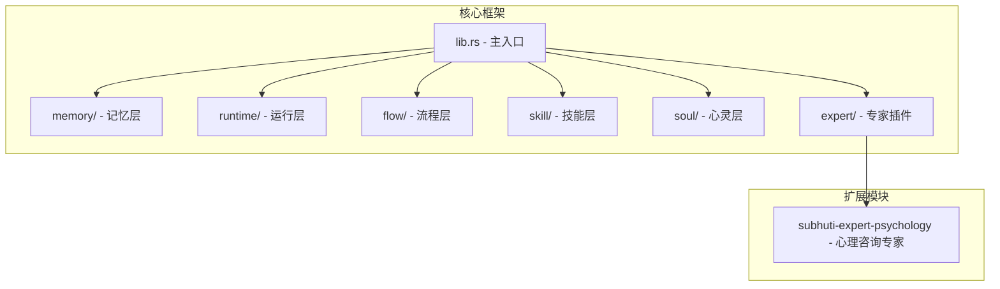
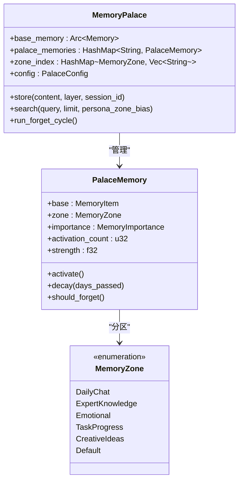
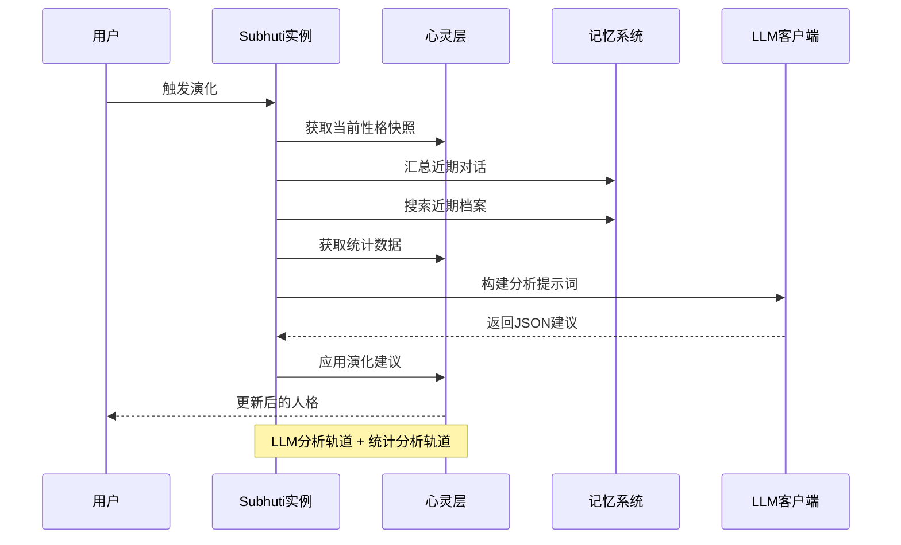
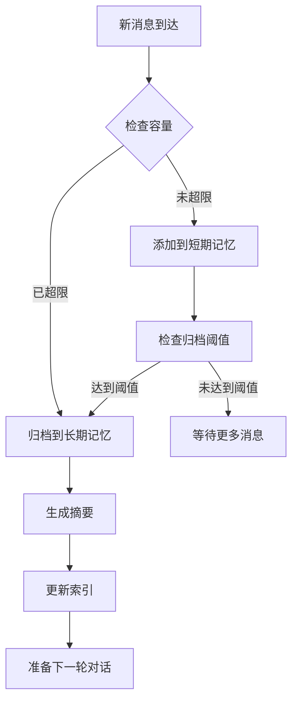
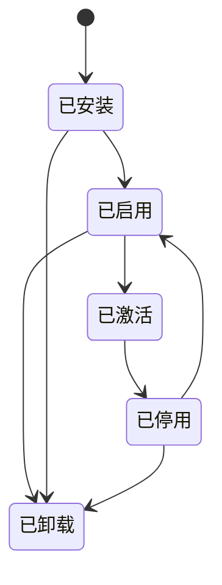
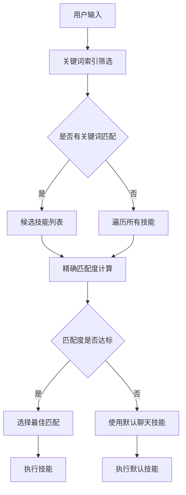
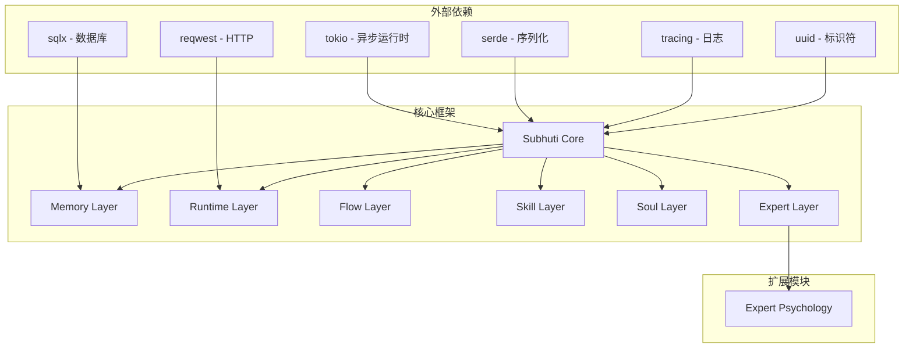

# 核心特性说明

<cite>
**本文档引用的文件**
- [lib.rs](file://crates/subhuti/src/lib.rs)
- [mod.rs](file://crates/subhuti/src/memory/mod.rs)
- [short_term.rs](file://crates/subhuti/src/memory/short_term.rs)
- [long_term.rs](file://crates/subhuti/src/memory/long_term.rs)
- [knowledge.rs](file://crates/subhuti/src/memory/knowledge.rs)
- [embedding.rs](file://crates/subhuti/src/memory/embedding.rs)
- [palace.rs](file://crates/subhuti/src/soul/palace.rs)
- [mod.rs](file://crates/subhuti/src/skill/mod.rs)
- [mod.rs](file://crates/subhuti/src/expert/mod.rs)
- [mod.rs](file://crates/subhuti/src/runtime/mod.rs)
- [mod.rs](file://crates/subhuti/src/flow/mod.rs)
- [lib.rs](file://crates/subhuti-expert-psychology/src/lib.rs)
- [persona.json](file://crates/subhuti/data/persona.json)
- [Cargo.toml](file://crates/subhuti/Cargo.toml)
- [main.rs](file://src/main.rs)
</cite>

## 目录
1. [简介](#简介)
2. [项目结构](#项目结构)
3. [核心组件](#核心组件)
4. [架构概览](#架构概览)
5. [详细组件分析](#详细组件分析)
6. [依赖分析](#依赖分析)
7. [性能考虑](#性能考虑)
8. [故障排除指南](#故障排除指南)
9. [结论](#结论)
10. [附录](#附录)

## 简介
Subhuti AI Agent 框架是一个极简轻量的 Rust 实现，采用"四层架构"设计：记忆层、运行层、流程层、扩展层。框架的核心特性包括：
- 动态人格系统：基于五大人格维度的可演进角色养成
- 记忆宫殿架构：三层记忆结构与分区化的记忆管理
- 专家插件生态：完整的插件生命周期与权限控制
- 技能系统：纯代码实现的灵活技能框架

## 项目结构
框架采用模块化设计，主要模块分布如下：



**图表来源**
- [lib.rs:22-34](file://crates/subhuti/src/lib.rs#L22-L34)
- [Cargo.toml:14-54](file://crates/subhuti/Cargo.toml#L14-L54)

**章节来源**
- [lib.rs:1-100](file://crates/subhuti/src/lib.rs#L1-L100)
- [Cargo.toml:1-63](file://crates/subhuti/Cargo.toml#L1-L63)

## 核心组件
框架的核心组件包括四个主要层次：

### 记忆层 (Memory Layer)
负责所有数据存储、检索、归档和分层治理，包含三层标准记忆：
- **短期工作记忆**：当前对话上下文，默认自动注入 LLM
- **长期归档记忆**：历史对话沉淀，AI 主动调用搜索
- **知识库语义记忆**：向量知识、外部文档，向量检索

### 运行层 (Runtime Layer)
真正执行层，包含：
- **LLM 抽象层**：统一模型 Trait（OpenAI/Ollama/Doubao/Custom）
- **工具系统**：极简 Tool Trait，name/desc/schema/run
- **约束护栏**：代码级强制限制，最大工具调用轮次、超时等

### 流程层 (Flow Layer)
Agent 智能闭环，支持多种流程策略：
- **SimpleFlow**：简单对话流程
- **ReactFlow**：ReAct 循环，自动工具调用
- **PlanActFlow**：先规划再执行

### 技能层 (Skill Layer)
纯代码风格的 Skill 系统，支持预设主流程模板：
- **全代码实现**：Skill 用代码实现，不需要声明式步骤
- **预设主流程**：提供 ReAct、Plan-Act、Simple、Chain-of-Thought 等模板
- **灵活选择**：Skill 开始前可以选择使用预设模板或完全自定义

**章节来源**
- [mod.rs:1-100](file://crates/subhuti/src/memory/mod.rs#L1-L100)
- [mod.rs:1-55](file://crates/subhuti/src/runtime/mod.rs#L1-L55)
- [mod.rs:1-50](file://crates/subhuti/src/flow/mod.rs#L1-L50)
- [mod.rs:1-50](file://crates/subhuti/src/skill/mod.rs#L1-L50)

## 架构概览
框架采用分层架构设计，各层职责清晰，耦合度低：

```mermaid
graph TB
subgraph "用户接口层"
UI[HTTP API<br/>CLI]
end
subgraph "应用层"
SM[Subhuti 主实例]
EM[扩展管理器]
end
subgraph "核心层"
ML[记忆层]
RL[运行层]
FL[流程层]
SL[技能层]
EL[专家层]
end
subgraph "基础设施层"
DB[(数据库)]
EMB[(嵌入服务)]
LLM[(LLM Provider)]
end
UI --> SM
SM --> EM
SM --> ML
SM --> RL
SM --> FL
SM --> SL
SM --> EL
ML <- --> DB
ML <- --> EMB
RL --> LLM
EL --> DB
SL --> ML
FL --> RL
FL --> ML
```

**图表来源**
- [lib.rs:84-156](file://crates/subhuti/src/lib.rs#L84-L156)
- [mod.rs:163-196](file://crates/subhuti/src/memory/mod.rs#L163-L196)

## 详细组件分析

### 动态人格系统 (Soul Layer)
动态人格系统是框架的核心创新，基于五大人格维度（Big Five）构建可演进的角色养成机制。

#### 人格维度设计
框架实现了完整的五大人格维度体系：
- **开放性 (Openness)**：想象力、创造力、好奇心
- **尽责性 (Conscientiousness)**：自律、目标导向、组织性
- **外向性 (Extraversion)**：社交性、活力、乐观
- **宜人性 (Agreeableness)**：合作性、信任、同情
- **神经质 (Neuroticism)**：情绪稳定性、焦虑倾向

#### 心灵宫殿架构
心灵宫殿是记忆与心灵的统一体，包含三层记忆结构和分区化管理：



**图表来源**
- [palace.rs:228-234](file://crates/subhuti/src/soul/palace.rs#L228-L234)
- [palace.rs:140-155](file://crates/subhuti/src/soul/palace.rs#L140-L155)
- [palace.rs:38-52](file://crates/subhuti/src/soul/palace.rs#L38-L52)

#### 演化机制
框架实现了双轨融合的演化机制：



**图表来源**
- [lib.rs:408-508](file://crates/subhuti/src/lib.rs#L408-L508)

**章节来源**
- [palace.rs:1-200](file://crates/subhuti/src/soul/palace.rs#L1-L200)
- [lib.rs:368-508](file://crates/subhuti/src/lib.rs#L368-L508)
- [persona.json:1-55](file://crates/subhuti/data/persona.json#L1-L55)

### 记忆宫殿架构
记忆宫殿提供了完整的三层记忆管理体系：

#### 短期记忆 (ShortTermMemory)
- **容量限制**：默认10条消息，超限自动归档
- **会话索引**：按会话ID快速检索
- **自动归档**：达到阈值时自动迁移到长期记忆

#### 长期记忆 (LongTermMemory)
- **历史沉淀**：不会自动进入上下文
- **主动检索**：AI必须主动调用工具搜索
- **关键词索引**：支持高效的关键词检索

#### 知识库 (KnowledgeMemory)
- **向量表示**：使用简化向量模型
- **余弦相似度**：计算语义相似度
- **可扩展性**：支持替换为专业向量数据库



**图表来源**
- [short_term.rs:30-47](file://crates/subhuti/src/memory/short_term.rs#L30-L47)
- [long_term.rs:31-53](file://crates/subhuti/src/memory/long_term.rs#L31-L53)
- [knowledge.rs:97-118](file://crates/subhuti/src/memory/knowledge.rs#L97-L118)

**章节来源**
- [mod.rs:1-100](file://crates/subhuti/src/memory/mod.rs#L1-L100)
- [short_term.rs:1-158](file://crates/subhuti/src/memory/short_term.rs#L1-L158)
- [long_term.rs:1-129](file://crates/subhuti/src/memory/long_term.rs#L1-L129)
- [knowledge.rs:1-166](file://crates/subhuti/src/memory/knowledge.rs#L1-L166)

### 专家插件生态
专家插件系统提供了完整的插件生命周期管理：

#### 插件生命周期


#### 权限控制系统
插件系统实现了细粒度的权限控制：
- **文件系统访问**：读/写权限分离
- **网络请求**：域名白名单机制
- **数据库访问**：SQL执行权限
- **代码执行**：沙箱隔离
- **外部API**：域名白名单

#### 钩子系统
插件可以在核心流程中挂载钩子：
- **BeforeRequest**：请求开始前
- **BeforeSkillMatch**：技能匹配前
- **BeforeSkillExecute**：技能执行前
- **BeforeResponse**：响应生成前
- **OnExpertSwitch**：专家切换时

**章节来源**
- [mod.rs:1-100](file://crates/subhuti/src/expert/mod.rs#L1-L100)
- [lib.rs:1-100](file://crates/subhuti-expert-psychology/src/lib.rs#L1-L100)

### 技能系统
技能系统采用纯代码实现，支持多种流程模板：

#### 流程模板类型
- **Simple**：简单对话，适合直接工具调用
- **ReAct**：多轮思考流程，适合复杂推理
- **PlanAct**：先规划再执行，适合需要规划的任务
- **ChainOfThought**：思维链，适合需要复杂推理的场景

#### 技能匹配机制


**图表来源**
- [mod.rs:604-653](file://crates/subhuti/src/skill/mod.rs#L604-L653)

#### 内置技能示例
框架内置了多个实用技能：
- **天气查询**：Simple模板，直接调用工具
- **计算器**：ReAct模板，多轮思考+工具调用
- **文件操作**：Simple模板，文件系统交互
- **网络搜索**：Simple模板，信息检索
- **代码执行**：Simple模板，代码运行
- **定时提醒**：Simple模板，任务管理

**章节来源**
- [mod.rs:800-990](file://crates/subhuti/src/skill/mod.rs#L800-L990)
- [mod.rs:992-1599](file://crates/subhuti/src/skill/mod.rs#L992-L1599)

## 依赖分析
框架的依赖关系呈现清晰的分层结构：



**图表来源**
- [Cargo.toml:14-54](file://crates/subhuti/Cargo.toml#L14-L54)

**章节来源**
- [Cargo.toml:1-63](file://crates/subhuti/Cargo.toml#L1-L63)

## 性能考虑
框架在设计时充分考虑了性能优化：

### 记忆系统优化
- **关键词索引**：使用哈希表实现 O(1) 查找
- **会话索引**：按会话ID快速定位记忆
- **容量控制**：短期记忆容量限制，防止内存膨胀
- **异步归档**：归档操作异步执行，不影响主线程

### 技能匹配优化
- **倒排索引**：关键词索引优化大规模技能匹配
- **分词算法**：支持中文分词和英文单词提取
- **优先级排序**：按优先级和匹配度排序
- **阈值控制**：可配置的匹配阈值

### 并发设计
- **Arc 共享**：全局资源使用 Arc 共享
- **Mutex 锁**：局部可变状态使用 Mutex 保护
- **RwLock 读写锁**：读多写少场景使用读写锁
- **Tokio 异步**：充分利用异步运行时优势

## 故障排除指南
### 常见问题及解决方案

#### 记忆系统问题
- **内存溢出**：检查短期记忆容量配置，合理设置归档阈值
- **检索缓慢**：确认关键词索引是否正确建立
- **数据丢失**：检查数据库连接状态和事务提交

#### LLM 集成问题
- **API 调用失败**：验证 API 密钥和网络连接
- **响应超时**：调整超时配置和重试机制
- **Token 消耗过高**：优化提示词和上下文长度

#### 插件系统问题
- **权限拒绝**：检查插件权限声明和沙箱配置
- **钩子执行异常**：验证钩子注册和回调函数
- **生命周期错误**：确认插件状态转换顺序

**章节来源**
- [lib.rs:573-647](file://crates/subhuti/src/lib.rs#L573-L647)

## 结论
Subhuti AI Agent 框架通过精心设计的四层架构，实现了高度模块化和可扩展的智能代理系统。其核心特性包括：

1. **动态人格系统**：基于五大人格维度的可演进角色养成，支持 LLM 分析轨道与统计分析轨道的双轨融合
2. **记忆宫殿架构**：三层记忆结构与分区化管理，提供高效的记忆检索和遗忘机制
3. **专家插件生态**：完整的插件生命周期管理，包含权限控制和钩子系统
4. **技能系统**：纯代码实现的灵活技能框架，支持多种流程模板

框架的设计哲学体现了"薄封装、无魔法、无全局状态、可完全掌控"的理念，既适合初学者快速上手，也为高级开发者提供了深度定制的能力。通过模块化设计和清晰的分层架构，框架展现了强大的扩展潜力和实际应用能力。

## 附录

### 快速开始示例
```rust
use subhuti::{Subhuti, Session};

let subhuti = Subhuti::new();
let session = Session::new("user_001");
let response = subhuti.run(session, "你好，帮我查一下天气").await;
```

### 配置选项
- **MemoryConfig**：短期记忆容量、归档阈值、向量维度
- **RuntimeConfig**：最大工具调用轮次、上下文长度、超时时间
- **FlowConfig**：最大迭代次数、自动重试、收敛阈值
- **PalaceConfig**：分区开关、遗忘机制、关联网络

### 扩展开发
框架提供了丰富的扩展点：
- **自定义技能**：实现 Skill trait，支持预设模板或完全自定义
- **专家插件**：实现 ExpertPlugin trait，提供领域专业知识
- **自定义流程**：实现 Flow trait，创建新的执行策略
- **工具扩展**：实现 Tool trait，添加新的外部能力

**章节来源**
- [main.rs:64-71](file://src/main.rs#L64-L71)
- [lib.rs:110-156](file://crates/subhuti/src/lib.rs#L110-L156)