# 项目介绍

<cite>
**本文档引用的文件**
- [Cargo.toml](file://Cargo.toml)
- [crates/subhuti/Cargo.toml](file://crates/subhuti/Cargo.toml)
- [crates/subhuti/src/lib.rs](file://crates/subhuti/src/lib.rs)
- [crates/subhuti/src/context.rs](file://crates/subhuti/src/context.rs)
- [crates/subhuti/src/memory/mod.rs](file://crates/subhuti/src/memory/mod.rs)
- [crates/subhuti/src/runtime/mod.rs](file://crates/subhuti/src/runtime/mod.rs)
- [crates/subhuti/src/flow/mod.rs](file://crates/subhuti/src/flow/mod.rs)
- [crates/subhuti/src/skill/mod.rs](file://crates/subhuti/src/skill/mod.rs)
- [crates/subhuti/src/soul/mod.rs](file://crates/subhuti/src/soul/mod.rs)
- [crates/subhuti/src/extension/mod.rs](file://crates/subhuti/src/extension/mod.rs)
- [crates/subhuti/src/db/mod.rs](file://crates/subhuti/src/db/mod.rs)
- [crates/subhuti/src/observe/mod.rs](file://crates/subhuti/src/observe/mod.rs)
- [crates/subhuti/src/expert/mod.rs](file://crates/subhuti/src/expert/mod.rs)
- [crates/subhuti/data/persona.json](file://crates/subhuti/data/persona.json)
- [src/main.rs](file://src/main.rs)
- [docs/QUICKSTART.md](file://docs/QUICKSTART.md)
- [docs/ROADMAP.md](file://docs/ROADMAP.md)
</cite>

## 目录
1. [简介](#简介)
2. [项目结构](#项目结构)
3. [核心组件](#核心组件)
4. [架构总览](#架构总览)
5. [详细组件分析](#详细组件分析)
6. [依赖关系分析](#依赖关系分析)
7. [性能考虑](#性能考虑)
8. [故障排除指南](#故障排除指南)
9. [结论](#结论)
10. [附录](#附录)

## 简介
Subhuti AI Agent 框架是一个基于 Rust 的极简轻量级 AI Agent 开发框架，旨在以“薄封装、无魔法、无全局状态”的设计哲学，帮助开发者快速构建具备 LLM、工具系统、记忆与心灵演化的智能体。框架采用四层架构：记忆层、运行层、流程层、扩展层，并在此基础上引入“心灵层”和“专家插件系统”，形成独特的“记忆-心灵-专家”三位一体能力。

- 核心价值主张
  - 极简与可控：通过清晰的模块边界与可插拔设计，开发者可以完全掌控 Agent 的行为与状态。
  - 记忆与心智：三层标准记忆（短期/长期/知识库）与“心灵宫殿”结合，支持记忆分区、重要性评估、遗忘机制与联想网络；配合动态人格系统，实现可演化的角色。
  - 专家生态：提供完整的专家插件生命周期管理、权限与沙箱控制、钩子系统，支持多领域专家能力注入与切换。
  - 开发友好：提供 HTTP API、CLI 工具、调试工具链、健康检查与可视化测试页面，快速上手与生产落地兼顾。

- 解决的问题
  - 传统 Agent 框架过于“魔法化”，难以掌控；Subhuti 通过“全局状态只读共享 + 请求级上下文”的分层设计，降低耦合、提升可维护性。
  - 记忆与心智割裂：通过“心灵宫殿”将记忆与人格统一，使 Agent 的行为更具一致性与可解释性。
  - 插件生态混乱：通过清单、权限、沙箱与钩子的标准化设计，构建安全、可控、可扩展的专家生态。

- 目标用户
  - 初学者：通过 Quickstart 快速体验，理解 Agent 的基本流程与核心能力。
  - 中级开发者：利用 Skill 系统与流程模板，快速实现特定领域的功能。
  - 高级开发者：通过扩展层与专家插件系统，构建复杂、可演化的智能体。

- 框架的独特定位与创新
  - “记忆宫殿 + 动态人格”的双轨演化：统计分析轨道（轻量、实时）与 LLM 自反思轨道（周期性、深度）融合，实现可解释且可持续的角色成长。
  - 纯代码 Skill 系统：Skill 以纯代码实现，支持可选的预设流程模板，既保证灵活性，又降低声明式复杂度。
  - 专家插件系统 v2.0：完整的生命周期管理、权限与沙箱控制、钩子系统，支持多领域专家能力注入与切换。
  - 可观测性与调试：提供 Trace 追踪、Token 统计、健康检查与调试工具，便于开发与运维。

- 背景故事、发展历史与未来愿景
  - 背景：在 LLM 应用爆发的背景下，如何在保持可控性的同时实现“像人一样思考”的智能体，成为 Subhuti 的出发点。
  - 发展：从最初的四层架构，逐步引入“心灵层”、“专家插件系统”、“可观测性系统”，并在 v1.x 达到相对成熟。
  - 未来：计划在 v2.0 完善流式输出、中间件系统与性能优化；v3.0 探索 Agent 网络、自我进化与可视化。

- 功能特性概览（简洁版）
  - 记忆系统：短期/长期/知识库三层记忆，支持文本与向量检索、归档与遗忘。
  - 运行时：统一 LLM 抽象、工具系统、约束护栏，支持流式输出与工具调用。
  - 流程层：Simple/ReAct/Plan-Act 等内置流程，支持自定义流程与流程模板。
  - Skill 层：纯代码实现，支持预设模板与流式输出，内置 8 个常用技能。
  - 心灵层：大五人格模型、动态演化、记忆宫殿、反馈驱动的人格成长。
  - 专家插件：清单、权限、沙箱、钩子、生命周期管理，支持多领域专家能力。
  - 扩展层：钩子生命周期、日志、敏感词过滤、Token 统计等可插拔能力。
  - 数据库：PostgreSQL + pgvector，支持记忆与人格数据持久化。
  - 可观测性：Trace 追踪、Span 树、统计指标与健康检查。
  - 开发工具：HTTP API、CLI 工具、调试工具、测试页面。

- 初学者与专家的双重视角
  - 初学者：通过 Quickstart 体验聊天、记忆检索、专家切换与系统健康检查，理解 Agent 的基本工作流。
  - 专家：利用扩展层、专家插件系统、流程模板与调试工具，构建复杂、可演化的智能体。

## 项目结构
框架采用多 crate 的 Workspace 组织方式，核心库位于 crates/subhuti，应用入口位于根目录的 src，文档位于 docs，测试与示例位于 crates/subhuti/tests 与项目根目录。

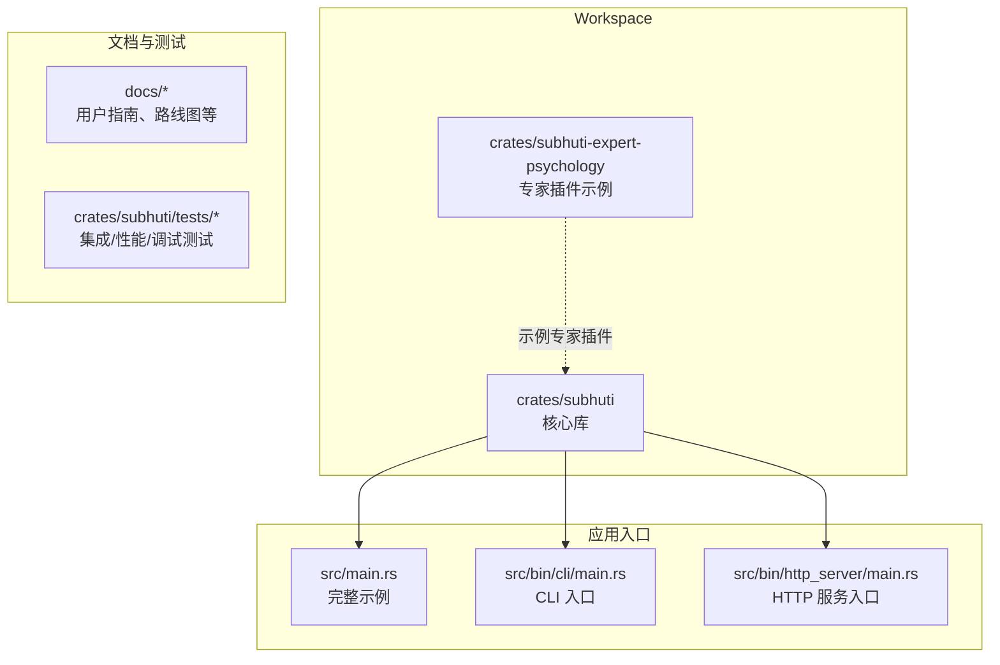

**图表来源**
- [Cargo.toml:1-58](file://Cargo.toml#L1-L58)
- [crates/subhuti/Cargo.toml:1-63](file://crates/subhuti/Cargo.toml#L1-L63)
- [src/main.rs:1-71](file://src/main.rs#L1-L71)

**章节来源**
- [Cargo.toml:1-58](file://Cargo.toml#L1-L58)
- [crates/subhuti/Cargo.toml:1-63](file://crates/subhuti/Cargo.toml#L1-L63)
- [src/main.rs:1-71](file://src/main.rs#L1-L71)

## 核心组件
- Subhuti 主入口与全局配置
  - SubhutiConfig：集中管理 LLM、运行时、记忆、流程、数据库等配置。
  - Subhuti：全局实例，负责初始化运行时、记忆、流程、扩展、技能、心灵层与专家插件，并提供 run/run_simple 等执行入口。
- 上下文与运行时
  - RunContext：请求级上下文，包含 Session、Token 统计与调用链。
  - Runtime：统一运行时，封装 LLM 客户端、工具系统与约束护栏。
- 记忆层
  - Memory：三层记忆（短期/长期/知识库）统一管理，支持文本与向量检索、归档与遗忘。
  - MemoryPalace：记忆宫殿，支持记忆分区、重要性评估、遗忘机制、联想网络与人格影响。
- 流程层
  - FlowManager：统一流程管理，支持 Simple/ReAct/Plan-Act/Custom 等流程类型。
  - FlowContext：流程执行上下文，封装会话、运行时、记忆与流程配置。
- Skill 层
  - SkillManager：Skill 管理器，支持关键词索引优化、匹配阈值与回退策略。
  - Skill：纯代码实现，支持预设流程模板与流式输出。
- 心灵层
  - SoulLayer：动态人格系统，基于大五人格模型与双轨演化（统计分析 + LLM 自反思）。
  - MemoryPalace：与心灵层联动，支持记忆宫殿的高级功能（遗忘周期、联想网络、人格影响）。
- 专家插件系统
  - PluginManager：专家插件生命周期管理（安装/启用/激活/停用/卸载）。
  - Hook 系统：在核心流程中插入自定义逻辑，支持权限与沙箱控制。
- 扩展层
  - ExtensionManager：扩展管理器，支持钩子生命周期（before_prompt/before_tool/after_tool/after_complete）。
- 数据库与可观测性
  - Database：PostgreSQL + pgvector 集成，支持记忆与人格数据持久化。
  - TraceObserver：可观测性系统，提供 Trace 追踪、Span 树与统计指标。

**章节来源**
- [crates/subhuti/src/lib.rs:54-107](file://crates/subhuti/src/lib.rs#L54-L107)
- [crates/subhuti/src/context.rs:18-87](file://crates/subhuti/src/context.rs#L18-L87)
- [crates/subhuti/src/runtime/mod.rs:30-72](file://crates/subhuti/src/runtime/mod.rs#L30-L72)
- [crates/subhuti/src/memory/mod.rs:30-52](file://crates/subhuti/src/memory/mod.rs#L30-L52)
- [crates/subhuti/src/flow/mod.rs:229-254](file://crates/subhuti/src/flow/mod.rs#L229-L254)
- [crates/subhuti/src/skill/mod.rs:451-466](file://crates/subhuti/src/skill/mod.rs#L451-L466)
- [crates/subhuti/src/soul/mod.rs:297-350](file://crates/subhuti/src/soul/mod.rs#L297-L350)
- [crates/subhuti/src/extension/mod.rs:112-123](file://crates/subhuti/src/extension/mod.rs#L112-L123)
- [crates/subhuti/src/db/mod.rs:11-42](file://crates/subhuti/src/db/mod.rs#L11-L42)
- [crates/subhuti/src/observe/mod.rs:1-48](file://crates/subhuti/src/observe/mod.rs#L1-L48)

## 架构总览
框架采用“四层架构 + 心灵层 + 专家层 + 扩展层”的设计，强调模块解耦与可插拔扩展。

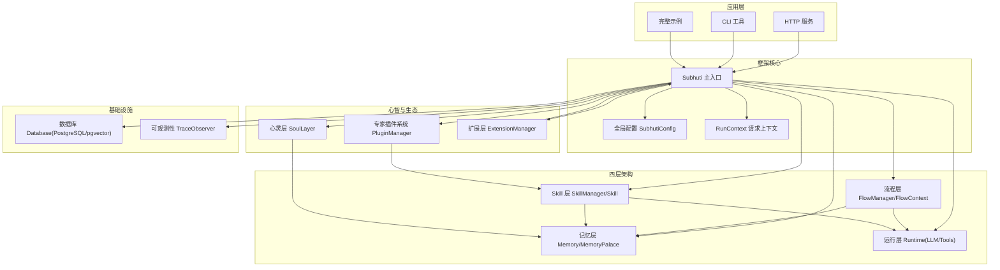

**图表来源**
- [crates/subhuti/src/lib.rs:84-156](file://crates/subhuti/src/lib.rs#L84-L156)
- [crates/subhuti/src/context.rs:58-86](file://crates/subhuti/src/context.rs#L58-L86)
- [crates/subhuti/src/memory/mod.rs:163-196](file://crates/subhuti/src/memory/mod.rs#L163-L196)
- [crates/subhuti/src/runtime/mod.rs:57-72](file://crates/subhuti/src/runtime/mod.rs#L57-L72)
- [crates/subhuti/src/flow/mod.rs:677-694](file://crates/subhuti/src/flow/mod.rs#L677-L694)
- [crates/subhuti/src/skill/mod.rs:451-466](file://crates/subhuti/src/skill/mod.rs#L451-L466)
- [crates/subhuti/src/soul/mod.rs:330-350](file://crates/subhuti/src/soul/mod.rs#L330-L350)
- [crates/subhuti/src/extension/mod.rs:112-123](file://crates/subhuti/src/extension/mod.rs#L112-L123)
- [crates/subhuti/src/db/mod.rs:44-48](file://crates/subhuti/src/db/mod.rs#L44-L48)
- [crates/subhuti/src/observe/mod.rs:42-48](file://crates/subhuti/src/observe/mod.rs#L42-L48)

## 详细组件分析

### Subhuti 主入口与全局配置
- 设计要点
  - 全局配置集中管理，支持 LLM、运行时、记忆、流程、数据库等。
  - Subhuti 实例负责初始化运行时、记忆、流程、扩展、技能、心灵层与专家插件。
  - 提供 run/run_simple 等统一执行入口，支持显式指定 Skill 与流程模板。
- 关键能力
  - 数据库初始化与连接传递至记忆与心灵层。
  - 专家插件的安装、启用、激活与停用。
  - 心灵层的演化与反馈统计。
  - 健康检查与调试工具。

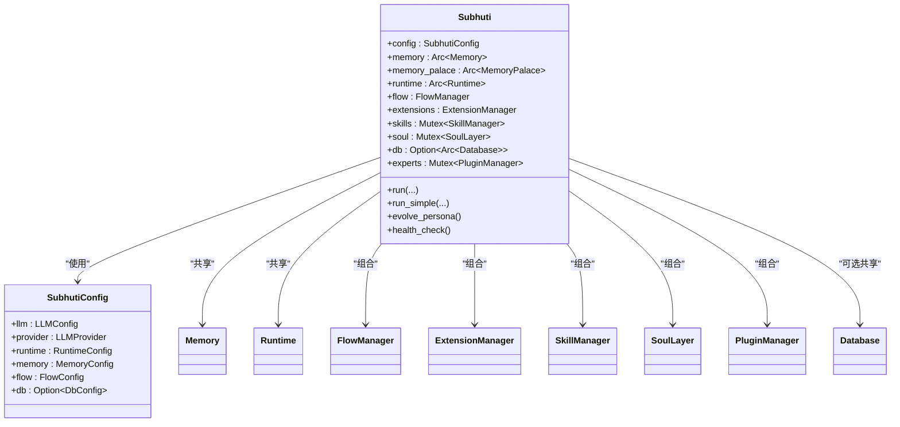

**图表来源**
- [crates/subhuti/src/lib.rs:54-107](file://crates/subhuti/src/lib.rs#L54-L107)
- [crates/subhuti/src/lib.rs:109-156](file://crates/subhuti/src/lib.rs#L109-L156)

**章节来源**
- [crates/subhuti/src/lib.rs:54-107](file://crates/subhuti/src/lib.rs#L54-L107)
- [crates/subhuti/src/lib.rs:109-156](file://crates/subhuti/src/lib.rs#L109-L156)

### 记忆层：三层记忆与记忆宫殿
- 设计要点
  - 三层标准记忆：短期工作记忆、长期归档记忆、知识库语义记忆。
  - MemoryPalace：记忆宫殿，支持记忆分区、重要性评估、遗忘机制、联想网络与人格影响。
  - 双写策略：内存与数据库并行，支持向量嵌入与语义检索。
- 关键能力
  - 写入短期记忆并自动归档到长期记忆。
  - 文本与向量检索，支持知识库与长期记忆。
  - 统计与裁剪，支持记忆摘要与容量控制。

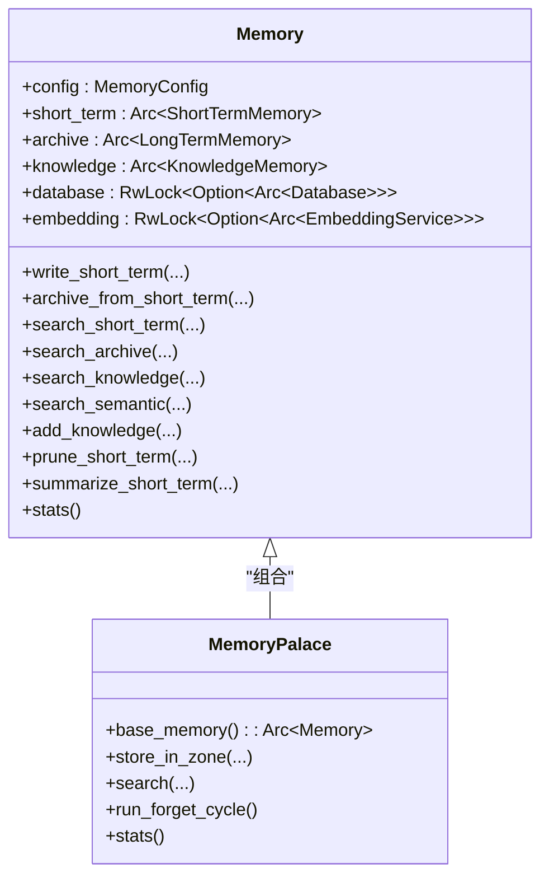

**图表来源**
- [crates/subhuti/src/memory/mod.rs:163-258](file://crates/subhuti/src/memory/mod.rs#L163-L258)
- [crates/subhuti/src/memory/mod.rs:30-52](file://crates/subhuti/src/memory/mod.rs#L30-L52)

**章节来源**
- [crates/subhuti/src/memory/mod.rs:163-258](file://crates/subhuti/src/memory/mod.rs#L163-L258)
- [crates/subhuti/src/memory/mod.rs:30-52](file://crates/subhuti/src/memory/mod.rs#L30-L52)

### 运行层：LLM 抽象与工具系统
- 设计要点
  - 统一 LLM 抽象，支持 OpenAI/Ollama/Doubao/Custom Provider。
  - 工具系统：极简 Tool Trait，支持 name/description/schema/run。
  - 约束护栏：最大工具调用轮次、超时等。
- 关键能力
  - 调用 LLM（普通/带工具/流式输出）。
  - 注入 Mock LLM 用于测试。
  - 注册与执行工具。

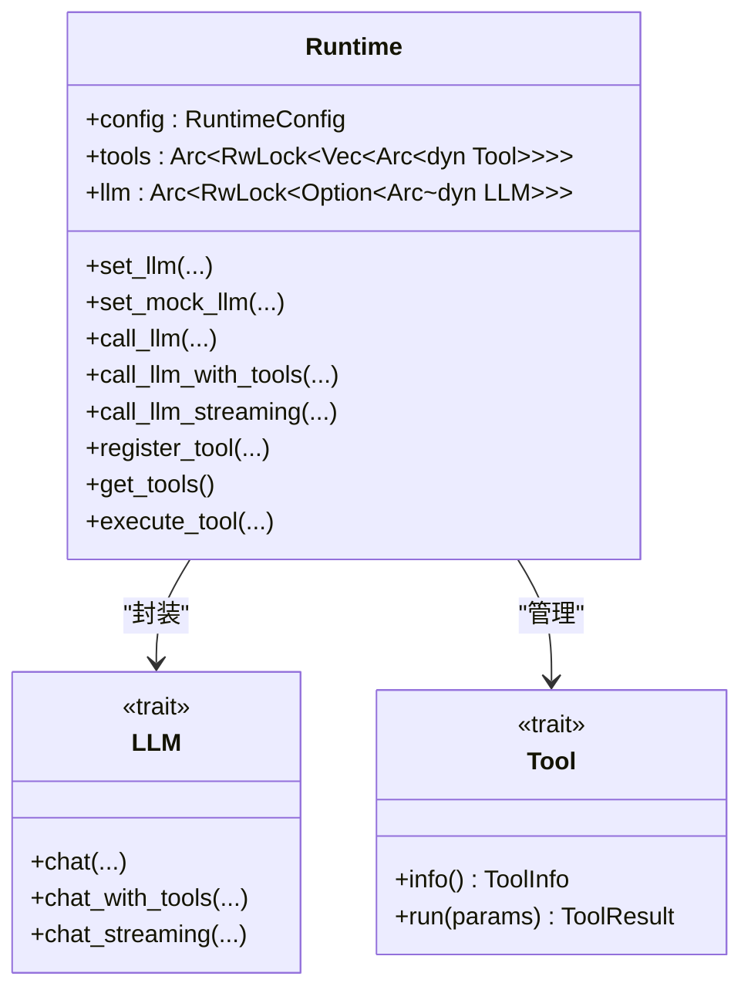

**图表来源**
- [crates/subhuti/src/runtime/mod.rs:57-72](file://crates/subhuti/src/runtime/mod.rs#L57-L72)
- [crates/subhuti/src/runtime/mod.rs:119-159](file://crates/subhuti/src/runtime/mod.rs#L119-L159)

**章节来源**
- [crates/subhuti/src/runtime/mod.rs:57-72](file://crates/subhuti/src/runtime/mod.rs#L57-L72)
- [crates/subhuti/src/runtime/mod.rs:119-159](file://crates/subhuti/src/runtime/mod.rs#L119-L159)

### 流程层：ReAct/Plan-Act/Simple 与自定义流程
- 设计要点
  - Flow trait：标准接口，支持自定义流程策略。
  - 内置流程：Simple、ReAct、Plan-Act。
  - FlowContext：流程执行上下文，封装会话、运行时、记忆与流程配置。
- 关键能力
  - 执行流程（默认/指定类型/自定义）。
  - 执行预设步骤（Skill 使用）。
  - 条件判断、并行执行、循环执行等 FlowStep。

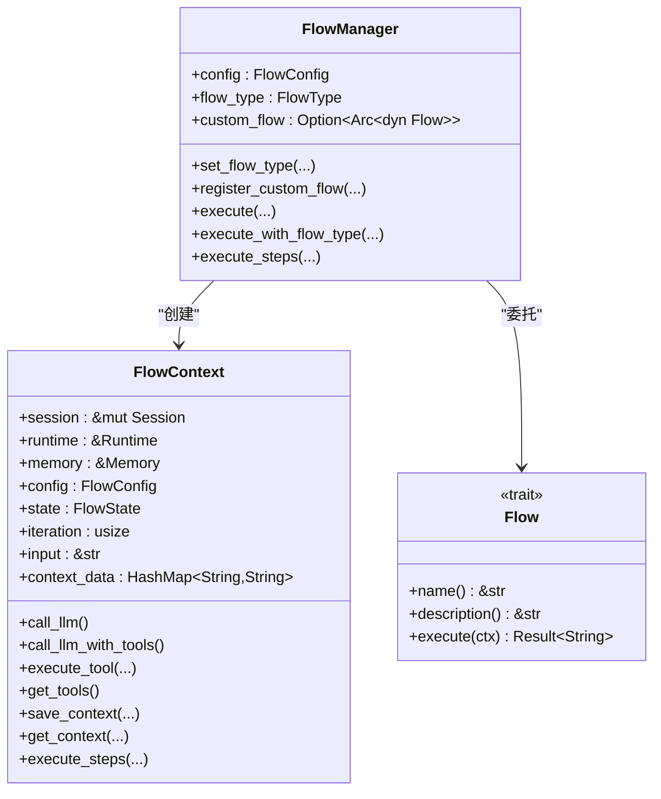

**图表来源**
- [crates/subhuti/src/flow/mod.rs:677-722](file://crates/subhuti/src/flow/mod.rs#L677-L722)
- [crates/subhuti/src/flow/mod.rs:290-310](file://crates/subhuti/src/flow/mod.rs#L290-L310)

**章节来源**
- [crates/subhuti/src/flow/mod.rs:677-722](file://crates/subhuti/src/flow/mod.rs#L677-L722)
- [crates/subhuti/src/flow/mod.rs:290-310](file://crates/subhuti/src/flow/mod.rs#L290-L310)

### Skill 层：纯代码实现与流程模板
- 设计要点
  - 纯代码风格：Skill 用代码实现，不需要声明式步骤。
  - 预设主流程：提供 ReAct/Plan-Act/Simple/Chain-of-Thought 等模板。
  - SkillManager：支持关键词索引优化、匹配阈值与回退策略。
- 关键能力
  - 匹配 Skill（关键词索引 + 精确匹配）。
  - 执行 Skill（纯代码或模板）。
  - 流式执行与 Token 统计。

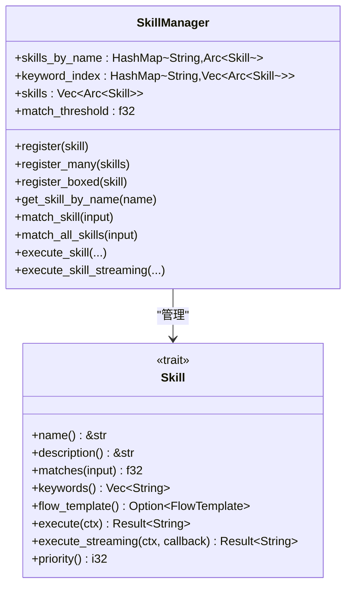

**图表来源**
- [crates/subhuti/src/skill/mod.rs:451-466](file://crates/subhuti/src/skill/mod.rs#L451-L466)
- [crates/subhuti/src/skill/mod.rs:256-317](file://crates/subhuti/src/skill/mod.rs#L256-L317)

**章节来源**
- [crates/subhuti/src/skill/mod.rs:451-466](file://crates/subhuti/src/skill/mod.rs#L451-L466)
- [crates/subhuti/src/skill/mod.rs:256-317](file://crates/subhuti/src/skill/mod.rs#L256-L317)

### 心灵层：动态人格与记忆宫殿
- 设计要点
  - 大五人格模型：开放性、尽责性、外向性、宜人性、情绪稳定性。
  - 双轨演化：统计分析轨道（轻量、实时）与 LLM 自反思轨道（周期性、深度）。
  - 记忆宫殿高级功能：遗忘周期、联想网络、人格影响的记忆分区偏好。
- 关键能力
  - 记录互动并更新技能熟练度、领域权重与性格五维。
  - 记录用户反馈并调整性格特征。
  - 触发演化并持久化历史版本。

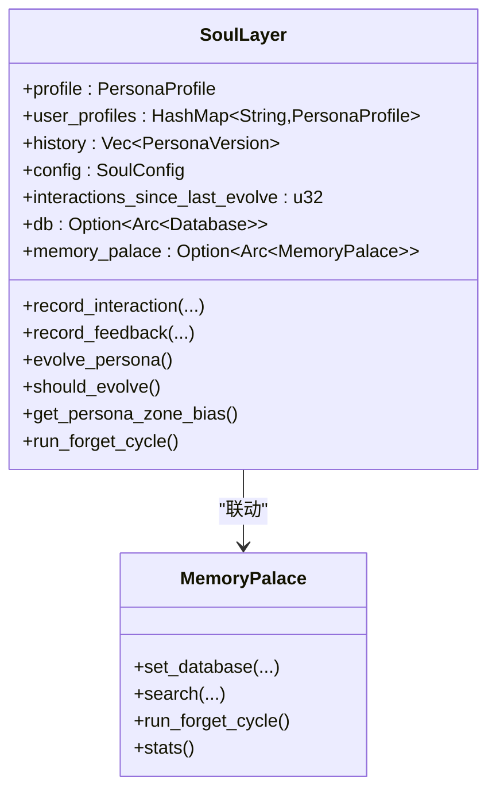

**图表来源**
- [crates/subhuti/src/soul/mod.rs:330-350](file://crates/subhuti/src/soul/mod.rs#L330-L350)
- [crates/subhuti/src/soul/mod.rs:447-461](file://crates/subhuti/src/soul/mod.rs#L447-L461)

**章节来源**
- [crates/subhuti/src/soul/mod.rs:330-350](file://crates/subhuti/src/soul/mod.rs#L330-L350)
- [crates/subhuti/src/soul/mod.rs:447-461](file://crates/subhuti/src/soul/mod.rs#L447-L461)

### 专家插件系统：生命周期与钩子
- 设计要点
  - 清单系统：插件元数据、版本、依赖、权限与钩子点。
  - 生命周期：安装 → 启用 → 激活 → 停用 → 卸载。
  - 钩子系统：在核心流程中插入自定义逻辑，支持权限与沙箱控制。
- 关键能力
  - 安装/启用/激活/停用/卸载专家插件。
  - 注入专家的人格、技能与知识库。
  - 执行钩子链并支持修改输入/响应。

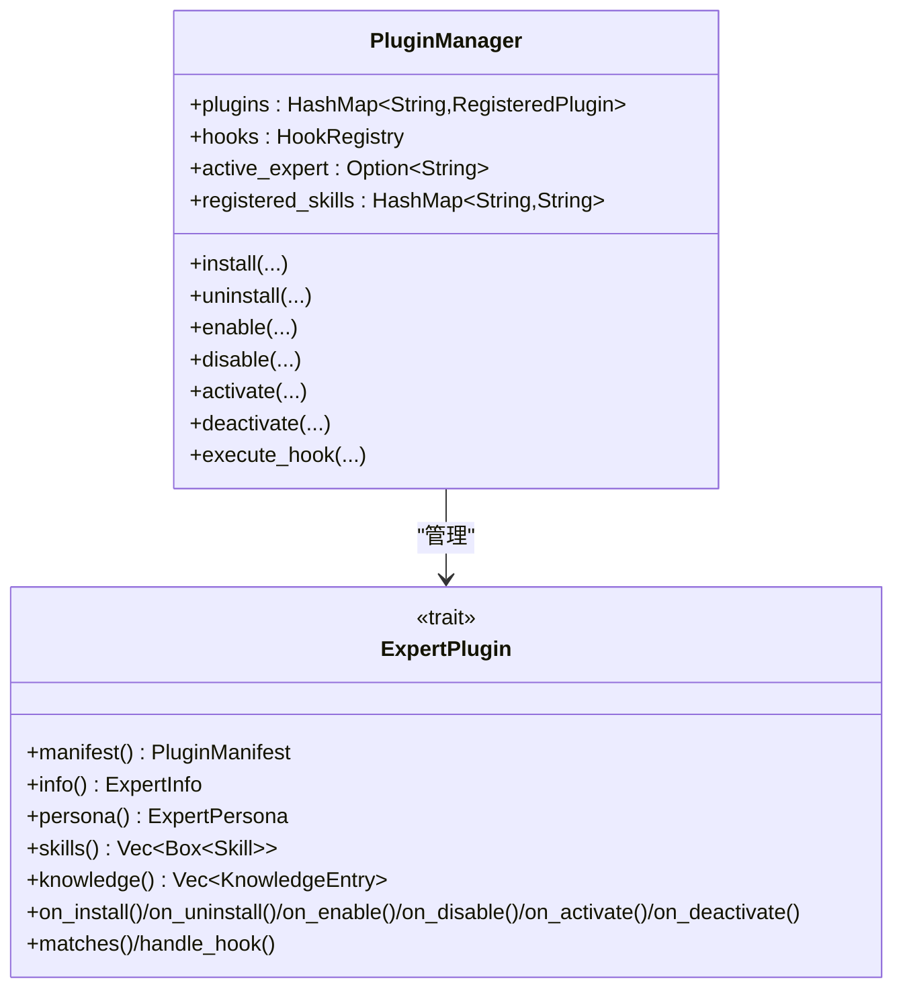

**图表来源**
- [crates/subhuti/src/expert/mod.rs:766-787](file://crates/subhuti/src/expert/mod.rs#L766-L787)
- [crates/subhuti/src/expert/mod.rs:660-760](file://crates/subhuti/src/expert/mod.rs#L660-L760)

**章节来源**
- [crates/subhuti/src/expert/mod.rs:766-787](file://crates/subhuti/src/expert/mod.rs#L766-L787)
- [crates/subhuti/src/expert/mod.rs:660-760](file://crates/subhuti/src/expert/mod.rs#L660-L760)

### 扩展层：钩子生命周期与内置扩展
- 设计要点
  - 生命周期 Hook：before_prompt/before_tool/after_tool/after_complete。
  - 内置扩展：日志、敏感词过滤、Token 统计等。
- 关键能力
  - 注册扩展与钩子。
  - 执行指定阶段的钩子链。
  - 自定义钩子处理器。

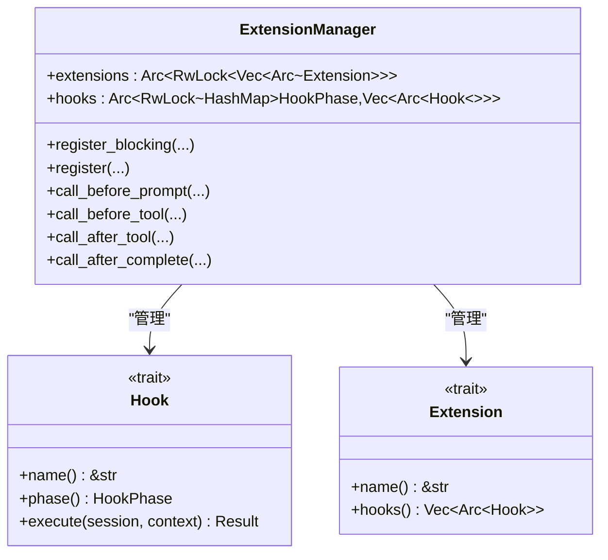

**图表来源**
- [crates/subhuti/src/extension/mod.rs:112-123](file://crates/subhuti/src/extension/mod.rs#L112-L123)
- [crates/subhuti/src/extension/mod.rs:42-53](file://crates/subhuti/src/extension/mod.rs#L42-L53)

**章节来源**
- [crates/subhuti/src/extension/mod.rs:112-123](file://crates/subhuti/src/extension/mod.rs#L112-L123)
- [crates/subhuti/src/extension/mod.rs:42-53](file://crates/subhuti/src/extension/mod.rs#L42-L53)

### 数据库与持久化
- 设计要点
  - PostgreSQL + pgvector：支持向量存储与语义检索。
  - 表结构：persona_profiles、persona_history、user_feedbacks、memories。
  - 迁移与索引：确保表结构一致与查询性能。
- 关键能力
  - 人员画像 CRUD、历史版本记录、反馈记录。
  - 记忆 CRUD、归档、文本检索与向量检索。
  - 向量嵌入更新与相似度搜索。

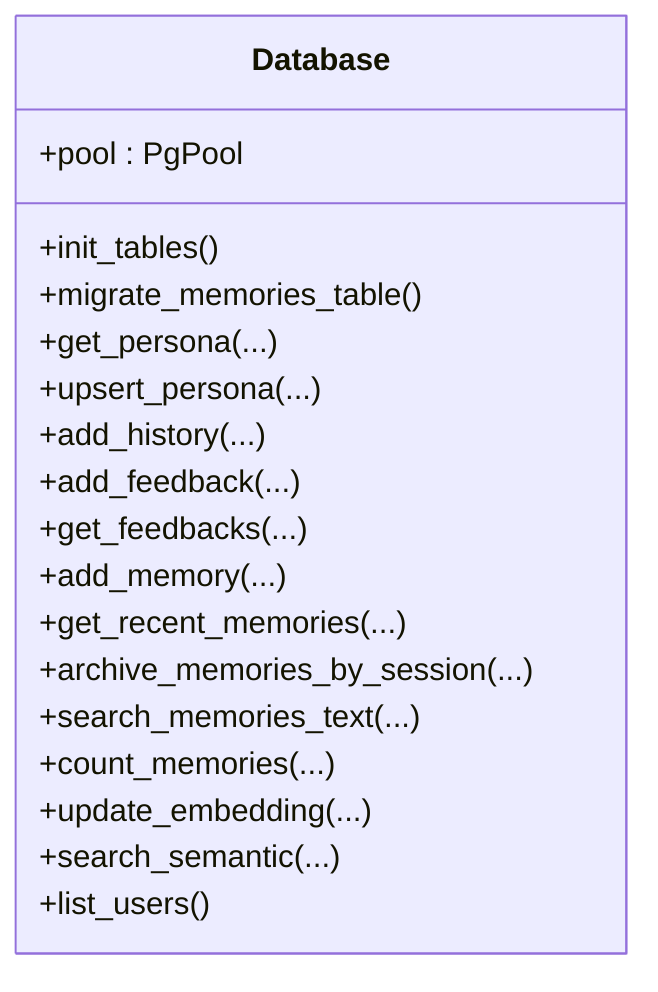

**图表来源**
- [crates/subhuti/src/db/mod.rs:44-48](file://crates/subhuti/src/db/mod.rs#L44-L48)
- [crates/subhuti/src/db/mod.rs:66-180](file://crates/subhuti/src/db/mod.rs#L66-L180)

**章节来源**
- [crates/subhuti/src/db/mod.rs:44-48](file://crates/subhuti/src/db/mod.rs#L44-L48)
- [crates/subhuti/src/db/mod.rs:66-180](file://crates/subhuti/src/db/mod.rs#L66-L180)

### 可观测性与调试
- 设计要点
  - TraceObserver：提供 Trace 追踪、Span 树与统计指标。
  - Token 统计：记录 Prompt/Completion/Total Token。
  - 健康检查：组件状态与详细报告。
- 关键能力
  - 创建 Trace、记录 Span、完成 Trace 并存储。
  - 统计 Token 使用并跨调用共享。
  - 输出健康报告并支持详细诊断。

**章节来源**
- [crates/subhuti/src/observe/mod.rs:1-48](file://crates/subhuti/src/observe/mod.rs#L1-L48)
- [crates/subhuti/src/context.rs:18-49](file://crates/subhuti/src/context.rs#L18-L49)

## 依赖关系分析
- 外部依赖
  - 异步运行时：Tokio。
  - 序列化：Serde。
  - 数据库：SQLx（PostgreSQL/pgvector）。
  - 日志：Tracing/Subscriber。
  - HTTP：Axum/Tower。
  - LLM 客户端：Reqwest。
  - 命令行参数：Clap。
  - 环境变量：Dotenvy。
  - UUID：UUID。
  - 流式输出：Async-stream/Tokio-stream。
- 内部模块耦合
  - Subhuti 作为中枢，组合 Memory/Runtime/Flow/Skill/Soul/Expert/Ext/DB/Observe。
  - FlowContext 依赖 Runtime 与 Memory，SkillContext 依赖 Runtime 与 Memory。
  - MemoryPalace 与 SoulLayer 联动，共同驱动记忆与人格演化。

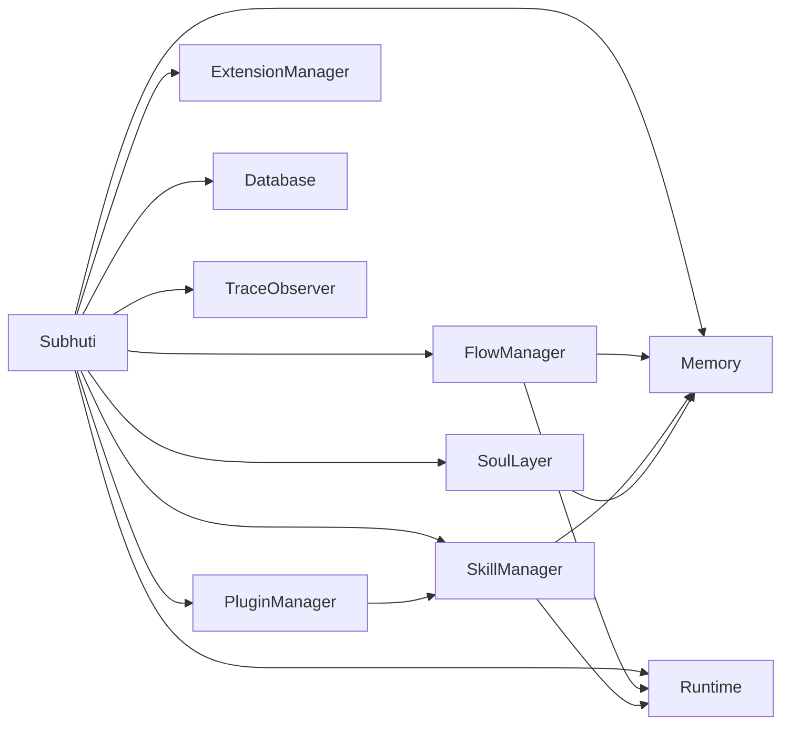

**图表来源**
- [crates/subhuti/src/lib.rs:22-45](file://crates/subhuti/src/lib.rs#L22-L45)
- [crates/subhuti/src/flow/mod.rs:677-722](file://crates/subhuti/src/flow/mod.rs#L677-L722)
- [crates/subhuti/src/skill/mod.rs:451-466](file://crates/subhuti/src/skill/mod.rs#L451-L466)

**章节来源**
- [crates/subhuti/src/lib.rs:22-45](file://crates/subhuti/src/lib.rs#L22-L45)
- [crates/subhuti/src/flow/mod.rs:677-722](file://crates/subhuti/src/flow/mod.rs#L677-L722)
- [crates/subhuti/src/skill/mod.rs:451-466](file://crates/subhuti/src/skill/mod.rs#L451-L466)

## 性能考虑
- 异步与并发
  - 使用 Tokio 异步运行时，所有 I/O 操作（数据库、HTTP、LLM）均为异步。
  - 使用 Arc + RwLock 实现全局共享与请求级可变状态分离。
- 记忆与检索
  - 短期记忆容量与长期归档阈值可配置，避免上下文膨胀。
  - 向量检索依赖 pgvector，需合理设置维度与索引。
- 工具与 LLM
  - 通过约束护栏限制最大工具调用轮次与超时，防止无限循环。
  - 流式输出支持逐步返回，改善用户体验。
- 数据库
  - 连接池与索引优化，避免高并发下的性能瓶颈。
- 可观测性
  - Token 统计与健康检查有助于定位性能问题。

## 故障排除指南
- 常见问题
  - LLM 连接失败：检查环境变量（如 API Key、Provider、Base URL）。
  - 数据库连接失败：确认连接字符串与 pgvector 扩展。
  - 记忆检索异常：检查向量维度与 embedding 更新。
- 调试工具
  - 健康检查：查看组件状态与详细报告。
  - Trace 追踪：记录完整的请求处理链路与 Span 树。
  - Token 统计：监控 Prompt/Completion/Total Token 使用情况。
  - 调试工具：TestTracker、Profiler、LockDetector 等。

**章节来源**
- [docs/QUICKSTART.md:241-269](file://docs/QUICKSTART.md#L241-L269)
- [crates/subhuti/src/lib.rs:573-647](file://crates/subhuti/src/lib.rs#L573-L647)
- [crates/subhuti/src/observe/mod.rs:1-48](file://crates/subhuti/src/observe/mod.rs#L1-L48)

## 结论
Subhuti AI Agent 框架通过“四层架构 + 心灵层 + 专家层 + 扩展层”的设计，在保持极简与可控的前提下，提供了从记忆、心智到专家生态的完整能力。它既适合初学者快速上手，也为高级开发者提供了强大的扩展空间。随着 v2.0 的流式输出与中间件系统、v3.0 的 Agent 网络与自我进化，Subhuti 将在 AI Agent 领域持续演进，为构建可演化的智能体提供坚实基础。

## 附录
- 快速开始
  - 环境准备、启动 HTTP 服务、发送第一条消息、体验心灵宫殿、查看系统状态。
- 路线图
  - 近期目标：示例专家插件、数据库深度整合、配置系统增强、更多内置技能。
  - 中期目标：流式输出、中间件系统、性能优化、多模态支持。
  - 长期愿景：Agent 网络、自我进化、可视化。

**章节来源**
- [docs/QUICKSTART.md:1-281](file://docs/QUICKSTART.md#L1-L281)
- [docs/ROADMAP.md:1-237](file://docs/ROADMAP.md#L1-L237)