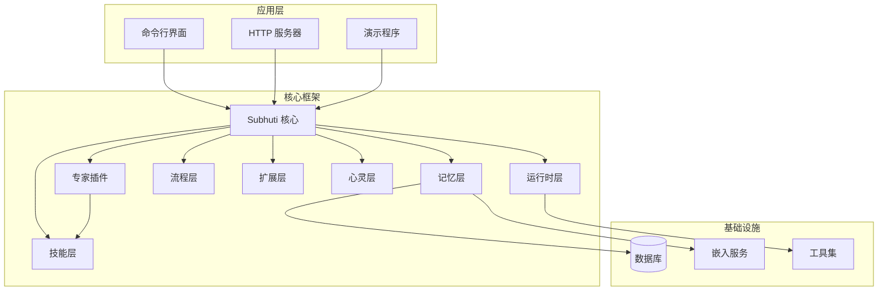
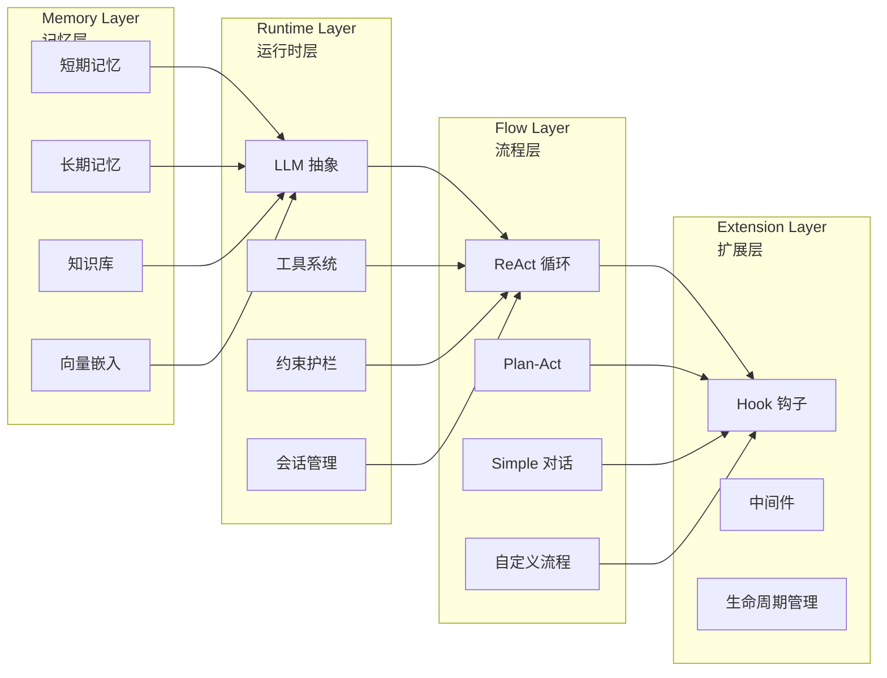
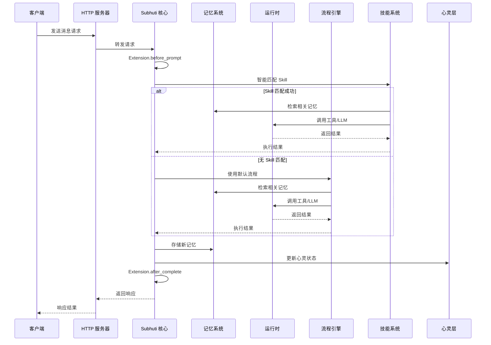
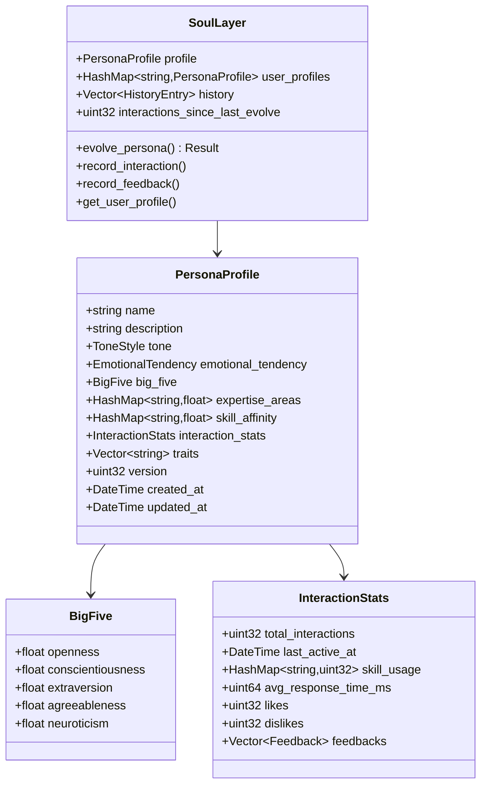
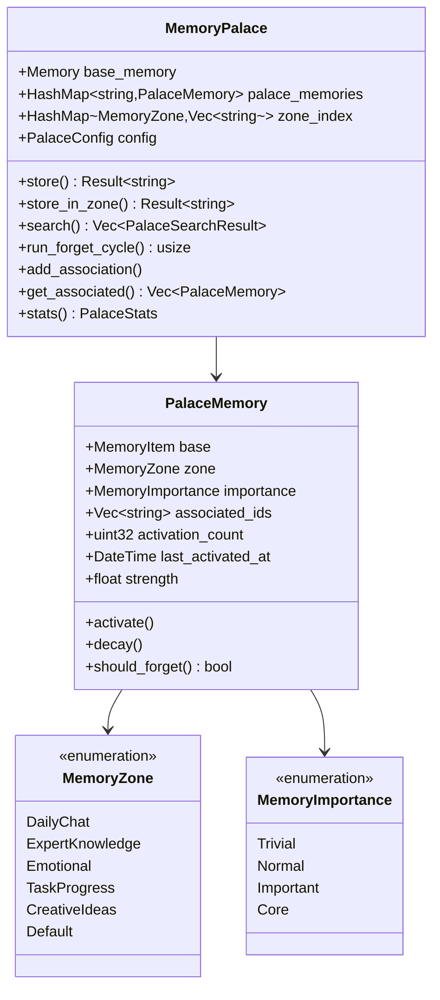
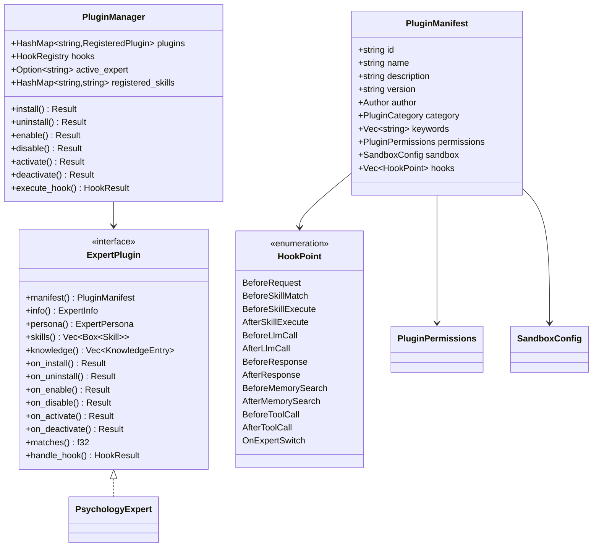
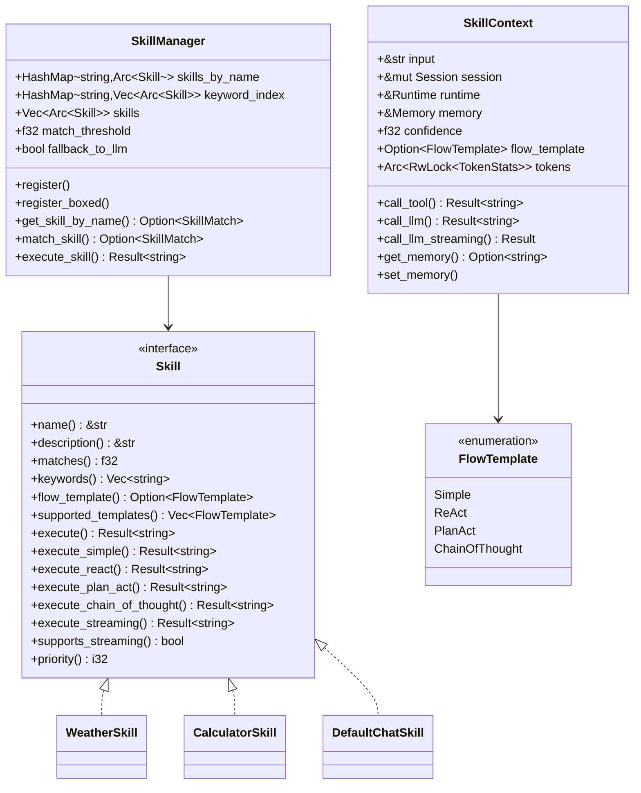
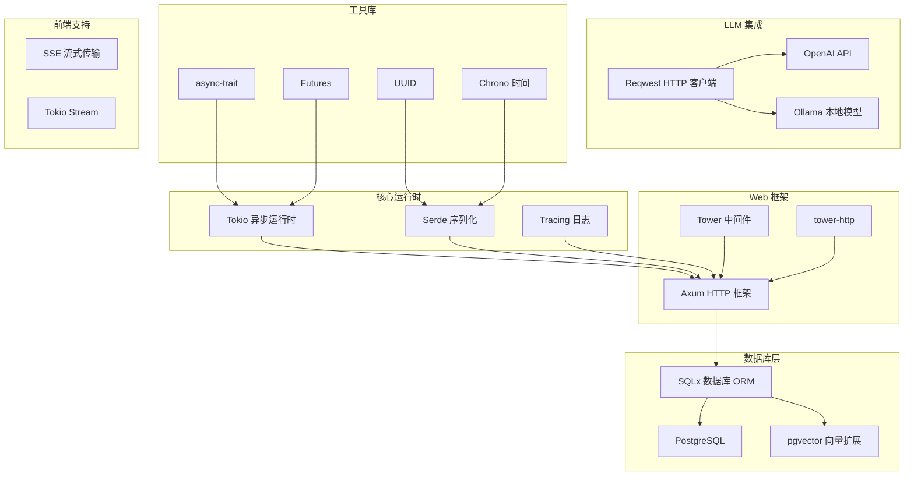
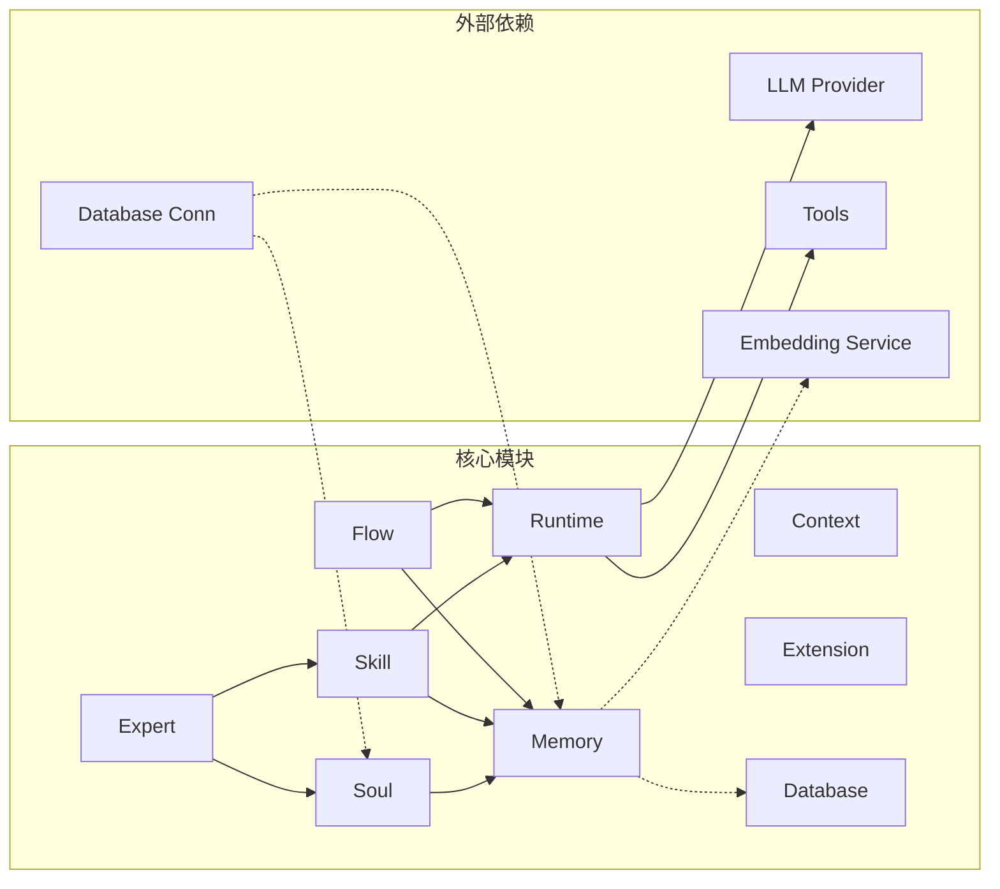
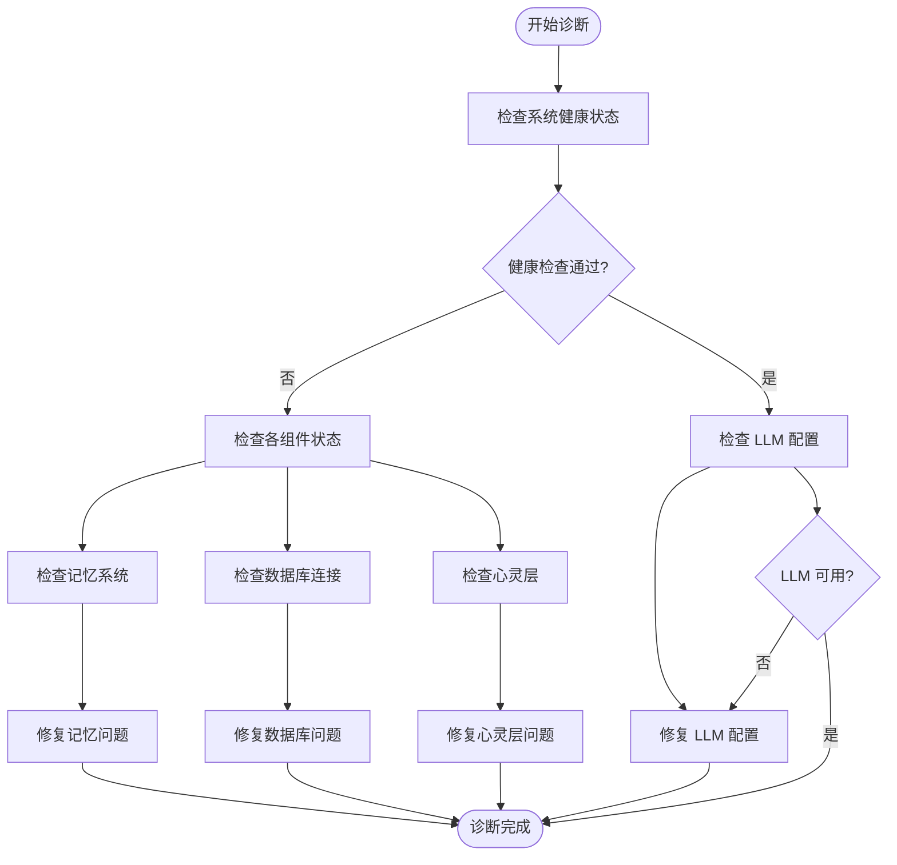

# 项目概述

<cite>
**本文档引用的文件**
- [Cargo.toml](file://Cargo.toml)
- [crates/subhuti/Cargo.toml](file://crates/subhuti/Cargo.toml)
- [crates/subhuti/src/lib.rs](file://crates/subhuti/src/lib.rs)
- [crates/subhuti/src/memory/mod.rs](file://crates/subhuti/src/memory/mod.rs)
- [crates/subhuti/src/runtime/mod.rs](file://crates/subhuti/src/runtime/mod.rs)
- [crates/subhuti/src/flow/mod.rs](file://crates/subhuti/src/flow/mod.rs)
- [crates/subhuti/src/skill/mod.rs](file://crates/subhuti/src/skill/mod.rs)
- [crates/subhuti/src/soul/palace.rs](file://crates/subhuti/src/soul/palace.rs)
- [crates/subhuti/src/expert/mod.rs](file://crates/subhuti/src/expert/mod.rs)
- [crates/subhuti-expert-psychology/src/lib.rs](file://crates/subhuti-expert-psychology/src/lib.rs)
- [src/main.rs](file://src/main.rs)
- [data/persona.json](file://data/persona.json)
- [docs/QUICKSTART.md](file://docs/QUICKSTART.md)
- [docs/API_TUTORIAL.md](file://docs/API_TUTORIAL.md)
</cite>

## 目录
1. [简介](#简介)
2. [项目结构](#项目结构)
3. [核心组件](#核心组件)
4. [架构总览](#架构总览)
5. [详细组件分析](#详细组件分析)
6. [依赖分析](#依赖分析)
7. [性能考虑](#性能考虑)
8. [故障排除指南](#故障排除指南)
9. [结论](#结论)
10. [附录](#附录)

## 简介

Subhuti AI Agent 框架是一个基于 Rust 的极简轻量级 AI Agent 框架，其核心价值主张在于"薄封装、无魔法、无全局状态、可完全掌控"的设计哲学。该框架采用四层架构设计（Memory → Runtime → Flow → Extension），通过模块化理念实现了高度可定制化的 AI Agent 开发体验。

### 核心设计理念

- **薄封装**：最小化抽象层，让开发者能够完全掌控每个环节
- **无魔法**：所有行为都有明确的实现逻辑，避免神秘的自动行为
- **无全局状态**：通过显式参数传递替代隐式全局状态
- **可完全掌控**：提供细粒度的控制接口，支持深度定制

### 技术特色

- **四层架构**：Memory（记忆）、Runtime（运行时）、Flow（流程）、Extension（扩展）
- **动态人格系统**：基于五大人格特质的可演进角色模型
- **记忆宫殿架构**：将记忆按主题分区管理，支持联想网络和遗忘机制
- **专家插件生态**：完整的插件生命周期管理和权限控制
- **纯代码风格 Skill 系统**：避免声明式配置，直接用代码实现业务逻辑

### 与其他框架的差异化优势

1. **架构清晰度**：四层分离明确，每层职责单一
2. **可观察性**：完整的 Trace 追踪和健康检查系统
3. **可扩展性**：钩子系统和插件机制支持深度定制
4. **可控性**：无魔法行为，所有流程可预测可调试
5. **性能优化**：关键词索引、滑动窗口、向量化搜索等优化策略

## 项目结构



**图表来源**
- [Cargo.toml:1-58](file://Cargo.toml#L1-L58)
- [crates/subhuti/src/lib.rs:22-46](file://crates/subhuti/src/lib.rs#L22-L46)

### 目录组织

项目采用 Workspace + Crate 的组织方式：

- **根目录**：应用入口和配置
- **crates/subhuti**：核心框架实现
- **crates/subhuti-expert-psychology**：专家插件示例
- **data/**：静态数据文件
- **docs/**：文档资源

**章节来源**
- [Cargo.toml:1-58](file://Cargo.toml#L1-L58)
- [crates/subhuti/Cargo.toml:1-63](file://crates/subhuti/Cargo.toml#L1-L63)

## 核心组件

### 四层架构设计

框架采用经典的四层架构，每层都有明确的职责边界：



**图表来源**
- [crates/subhuti/src/lib.rs:5-11](file://crates/subhuti/src/lib.rs#L5-L11)

### 记忆系统

记忆系统采用三层标准架构：
- **短期工作记忆**：当前对话上下文，默认自动注入 LLM
- **长期归档记忆**：历史对话沉淀，AI 主动调用搜索
- **知识库语义记忆**：向量知识、外部文档，向量检索

**章节来源**
- [crates/subhuti/src/memory/mod.rs:5-10](file://crates/subhuti/src/memory/mod.rs#L5-L10)

### 运行时系统

运行时层负责真正的执行能力：
- **LLM 抽象层**：统一模型 Trait（OpenAI / Ollama / 任意兼容）
- **工具系统**：极简 Tool Trait，name/desc/schema/run
- **约束护栏**：代码级强制限制，最大工具调用轮次、超时等

**章节来源**
- [crates/subhuti/src/runtime/mod.rs:5-11](file://crates/subhuti/src/runtime/mod.rs#L5-L11)

### 流程系统

流程层支持多种智能闭环策略：
- **SimpleFlow**：简单对话，无工具调用
- **ReactFlow**：ReAct 循环，自动工具调用
- **PlanActFlow**：先规划再执行
- **自定义流程**：类似中间件的可插拔设计

**章节来源**
- [crates/subhuti/src/flow/mod.rs:11-18](file://crates/subhuti/src/flow/mod.rs#L11-L18)

### 扩展系统

扩展层提供 Hook/中间件扩展能力：
- **生命周期钩子**：请求开始、Skill 匹配、LLM 调用、响应生成等
- **权限控制**：文件、网络、数据库访问控制
- **沙箱隔离**：限制插件能力范围

**章节来源**
- [crates/subhuti/src/expert/mod.rs:1-10](file://crates/subhuti/src/expert/mod.rs#L1-L10)

## 架构总览



**图表来源**
- [crates/subhuti/src/lib.rs:644-695](file://crates/subhuti/src/lib.rs#L644-L695)

## 详细组件分析

### 动态人格系统

动态人格系统基于五大人格特质（Big Five）构建，支持渐进式演化：



**图表来源**
- [crates/subhuti/src/soul/palace.rs:552-590](file://crates/subhuti/src/soul/palace.rs#L552-L590)

### 记忆宫殿架构

记忆宫殿将记忆按主题分区管理，支持联想网络和遗忘机制：



**图表来源**
- [crates/subhuti/src/soul/palace.rs:226-225](file://crates/subhuti/src/soul/palace.rs#L226-L225)

### 专家插件生态系统

专家插件提供完整的生命周期管理和权限控制：



**图表来源**
- [crates/subhuti/src/expert/mod.rs:658-760](file://crates/subhuti/src/expert/mod.rs#L658-L760)

### 技能系统

技能系统采用纯代码风格，支持预设主流程模板：



**图表来源**
- [crates/subhuti/src/skill/mod.rs:255-405](file://crates/subhuti/src/skill/mod.rs#L255-L405)

## 依赖分析

### 技术栈概览

框架采用现代化的 Rust 生态系统：



**图表来源**
- [Cargo.toml:25-58](file://Cargo.toml#L25-L58)
- [crates/subhuti/Cargo.toml:14-54](file://crates/subhuti/Cargo.toml#L14-L54)

### 模块耦合关系



**图表来源**
- [crates/subhuti/src/lib.rs:22-46](file://crates/subhuti/src/lib.rs#L22-L46)

**章节来源**
- [Cargo.toml:25-58](file://Cargo.toml#L25-L58)
- [crates/subhuti/Cargo.toml:14-54](file://crates/subhuti/Cargo.toml#L14-L54)

## 性能考虑

### 记忆系统优化

1. **滑动窗口机制**：短期记忆容量限制，超额消息自动归档
2. **关键词索引**：Skill 匹配使用倒排索引，支持 1000+ Skill 的高效查找
3. **向量化搜索**：结合 pgvector 实现语义相似度检索
4. **异步双写策略**：内存 + 数据库双写，保证一致性

### 并发控制

1. **Arc + Mutex 设计**：全局状态使用 Arc 共享，局部状态使用 Mutex 保护
2. **RwLock 优化**：读多写少场景使用读写锁分离
3. **Tokio 异步执行**：所有 I/O 操作异步化，避免阻塞

### 内存管理

1. **弱引用设计**：避免循环引用导致的内存泄漏
2. **延迟加载**：插件和专家按需加载
3. **缓存策略**：热点数据缓存，冷数据定期清理

## 故障排除指南

### 常见问题诊断



**图表来源**
- [crates/subhuti/src/lib.rs:562-642](file://crates/subhuti/src/lib.rs#L562-L642)

### 调试工具

框架提供了完善的调试工具：
- **健康检查**：系统状态监控和诊断
- **Trace 追踪**：完整的请求链路追踪
- **性能分析**：Token 统计和性能指标
- **锁检测**：死锁和性能瓶颈分析

**章节来源**
- [crates/subhuti/src/lib.rs:47-49](file://crates/subhuti/src/lib.rs#L47-L49)

## 结论

Subhuti AI Agent 框架通过其独特的四层架构设计和模块化理念，在 AI Agent 开发领域实现了显著的创新。其核心优势体现在：

1. **架构清晰**：四层分离明确，职责边界清晰
2. **可观察性强**：完整的追踪和诊断体系
3. **可扩展性好**：钩子系统和插件机制支持深度定制
4. **可控性高**：无魔法行为，所有流程可预测可调试
5. **性能优化**：多维度的性能优化策略

该框架特别适合需要深度定制和严格控制的 AI Agent 应用场景，为开发者提供了从基础对话到复杂业务逻辑的完整解决方案。

## 附录

### 快速开始

```bash
# 克隆项目
git clone <repository-url> subhuti-app
cd subhuti-app

# 启动 HTTP 服务器
cargo run --bin http_server

# 发送第一条消息
curl -X POST http://localhost:8080/subhuti/api/v1/chat \
  -H "Content-Type: application/json" \
  -d '{"message": "你好，我是小明", "user_id": "test_user_001"}'
```

**章节来源**
- [docs/QUICKSTART.md:43-101](file://docs/QUICKSTART.md#L43-L101)

### API 参考

框架提供完整的 REST API 接口：
- **聊天接口**：基础对话功能
- **流式聊天**：Server-Sent Events 支持
- **心灵宫殿**：记忆管理功能
- **专家插件**：插件生命周期管理
- **系统监控**：健康检查和追踪

**章节来源**
- [docs/API_TUTORIAL.md:18-83](file://docs/API_TUTORIAL.md#L18-L83)