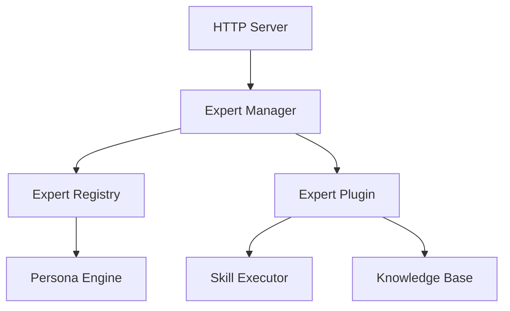

# [版本号] 概要设计文档

> **版本**: v0.x.0  
> **日期**: YYYY-MM-DD  
> **状态**: 草稿/评审中/已批准  
> **作者**: XXX

---

## 📋 目录

- [设计概述](#设计概述)
- [架构设计](#架构设计)
- [模块设计](#模块设计)
- [接口设计](#接口设计)
- [数据库设计](#数据库设计)
- [性能设计](#性能设计)
- [安全设计](#安全设计)
- [测试策略](#测试策略)

---

## 设计概述

### 设计目标

描述本版本的技术设计目标和约束条件。

**示例**：
```
本版本需要在不影响现有功能的前提下，实现专家插件系统的可扩展架构，
支持热插拔的专家模块，同时保证 API 响应时间 < 500ms。
```

### 设计原则

- **原则 1**: 例如：高内聚低耦合
- **原则 2**: 例如：接口优先
- **原则 3**: 例如：向后兼容

### 技术约束

- Rust 版本：>= 1.75
- 数据库：PostgreSQL 14+ with pgvector
- 部署方式：Docker 容器

---

## 架构设计

### 整体架构

```
┌─────────────────────────────────────────────┐
│              HTTP Server                     │
│  ┌───────────┐  ┌──────────┐  ┌──────────┐ │
│  │  Router   │→ │  Handler │→ │  Service │ │
│  └───────────┘  └──────────┘  └──────────┘ │
└─────────────────────────────────────────────┘
         ↓                      ↓
┌──────────────┐      ┌──────────────────┐
│  Database    │      │  Expert System   │
│  (PostgreSQL)│      │  (Plugin Arch)   │
└──────────────┘      └──────────────────┘
```

### 模块关系



---

## 模块设计

### 模块 1: 专家管理器 (ExpertManager)

**职责**：
- 管理专家插件的生命周期
- 处理专家激活/停用
- 协调专家匹配

**接口**：
```rust
pub struct ExpertManager {
    registry: ExpertRegistry,
    active_expert: Option<ExpertPlugin>,
}

impl ExpertManager {
    pub fn register(&mut self, expert: ExpertPlugin);
    pub fn activate(&mut self, expert_id: &str) -> Result<()>;
    pub fn deactivate(&mut self);
    pub fn match_expert(&self, input: &str) -> Option<ExpertPlugin>;
}
```

**状态机**：
```
[未激活] ──activate()──→ [已激活]
   ↑                        │
   │                        │ deactivate()
   └────────────────────────┘
```

---

### 模块 2: 专家注册表 (ExpertRegistry)

**职责**：
- 存储所有已注册的专家
- 提供查询和检索功能

**数据结构**：
```rust
pub struct ExpertRegistry {
    experts: HashMap<String, ExpertPlugin>,
}

pub struct ExpertPlugin {
    pub id: String,
    pub name: String,
    pub description: String,
    pub persona: PersonaProfile,
    pub skills: Vec<Skill>,
    pub knowledge_base: KnowledgeBase,
}
```

---

## 接口设计

### API 1: 激活专家

**端点**：`POST /subhuti/api/v1/experts/:id/activate`

**请求**：
```json
{
  "expert_id": "psychology"
}
```

**响应**：
```json
{
  "success": true,
  "data": {
    "id": "psychology",
    "name": "心理咨询师",
    "persona": { ... }
  }
}
```

**错误码**：
- `404`: 专家不存在
- `400`: 参数错误
- `500`: 内部错误

---

### API 2: 专家匹配

**端点**：`POST /subhuti/api/v1/experts/match`

**请求**：
```json
{
  "input": "我最近压力很大，睡不着觉"
}
```

**响应**：
```json
{
  "success": true,
  "data": {
    "expert_id": "psychology",
    "confidence": 0.92,
    "reason": "检测到情绪困扰关键词"
  }
}
```

---

## 数据库设计

### 表 1: expert_plugins

```sql
CREATE TABLE expert_plugins (
    id VARCHAR(64) PRIMARY KEY,
    name VARCHAR(128) NOT NULL,
    description TEXT,
    persona_config JSONB,
    skills_config JSONB,
    created_at TIMESTAMP DEFAULT NOW(),
    updated_at TIMESTAMP DEFAULT NOW()
);
```

### 表 2: expert_activations

```sql
CREATE TABLE expert_activations (
    id SERIAL PRIMARY KEY,
    user_id VARCHAR(64),
    expert_id VARCHAR(64) REFERENCES expert_plugins(id),
    activated_at TIMESTAMP DEFAULT NOW(),
    deactivated_at TIMESTAMP
);
```

---

## 性能设计

### 性能优化策略

1. **缓存策略**
   - 专家注册表缓存到内存
   - Persona 配置缓存，TTL 5 分钟

2. **并发控制**
   - 使用 `Arc<RwLock>` 保护共享状态
   - 读多写少场景优先读锁

3. **数据库优化**
   - 专家 ID 建立索引
   - 使用连接池（max 10）

### 性能指标

| 操作 | 目标 | 测量方法 |
|------|------|---------|
| 专家激活 | < 100ms | API 响应时间 |
| 专家匹配 | < 50ms | 内部函数耗时 |
| 并发请求 | 100 QPS | 压力测试 |

---

## 安全设计

### 认证授权

- API Key 验证（通过环境变量）
- 专家激活需要用户认证

### 数据安全

- 敏感配置加密存储
- 日志脱敏（不记录 API Key）

### 防护措施

- SQL 注入防护（使用参数化查询）
- XSS 防护（响应头设置）
- CORS 配置（限制来源）

---

## 测试策略

### 单元测试

**覆盖模块**：
- ExpertManager 核心逻辑
- ExpertRegistry 增删改查
- 专家匹配算法

**目标覆盖率**：> 80%

### 集成测试

**测试场景**：
1. 完整专家激活流程
2. 专家切换流程
3. API 端到端测试

### 性能测试

**测试工具**：
- `wrk` 或 `ab` 进行压力测试

**测试指标**：
- P95 响应时间
- 吞吐量（QPS）
- 错误率

---

## 变更历史

| 日期 | 版本 | 作者 | 变更内容 |
|------|------|------|---------|
| YYYY-MM-DD | v0.1 | XXX | 初始版本 |

---

## 审批

| 角色 | 姓名 | 签字 | 日期 |
|------|------|------|------|
| 架构师 | | | |
| 技术负责人 | | | |
| 开发负责人 | | | |
